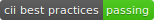

[Skip to content](#start-of-content)


[Pull requests](https://github.com/pulls) [Issues](https://github.com/issues)

[Marketplace](https://github.com/marketplace)

[Explore](https://github.com/explore)


# [nvm-sh](https://github.com/nvm-sh) / **[nvm](https://github.com/nvm-sh/nvm)**

- Sponsor
- Watch [916](https://github.com/nvm-sh/nvm/watchers)
- [47.4k](https://github.com/nvm-sh/nvm/stargazers)
    
- Fork
    
    [4.8k](https://github.com/nvm-sh/nvm/network/members)

- [Code](https://github.com/nvm-sh/nvm)
- [Issues 246](https://github.com/nvm-sh/nvm/issues)
- [Pull requests 69](https://github.com/nvm-sh/nvm/pulls)
- [Actions](https://github.com/nvm-sh/nvm/actions)
- [Security](https://github.com/nvm-sh/nvm/security)
- [Insights](https://github.com/nvm-sh/nvm/pulse)

master

[**25** branches](https://github.com/nvm-sh/nvm/branches) [**89** tags](https://github.com/nvm-sh/nvm/tags)

[Go to file](https://github.com/nvm-sh/nvm/find/master) Add file Code

## Latest commit

 [](https://github.com/RodEsp) [](https://github.com/ljharb)

[RodEsp](https://github.com/nvm-sh/nvm/commits?author=RodEsp "View all commits by RodEsp") and [ljharb](https://github.com/nvm-sh/nvm/commits?author=ljharb "View all commits by ljharb") [\[Fix\] \`nvm_alias\`: ensure \`lts/-1\` returns the one before \`lts/*\`](/nvm-sh/nvm/commit/4da7f101a2d00521eba5fa69a4bd9394bf5c817b "[Fix] `nvm_alias`: ensure `lts/-1` returns the one before `lts/*`

Fixes #2461")

[4da7f10](https://github.com/nvm-sh/nvm/commit/4da7f101a2d00521eba5fa69a4bd9394bf5c817b) [2 days ago](https://github.com/nvm-sh/nvm/commit/4da7f101a2d00521eba5fa69a4bd9394bf5c817b)

## Git stats

- [**1,970** commits](https://github.com/nvm-sh/nvm/commits/master)

## Files

Type

Name

Latest commit message

Commit time

[.github](https://github.com/nvm-sh/nvm/tree/master/.github ".github")

[\[actions\] update workflows](https://github.com/nvm-sh/nvm/commit/4c11ab1ac63cdd1d0dfc8e87b7c655d17d28401a "[actions] update workflows")

last month

[test](https://github.com/nvm-sh/nvm/tree/master/test "test")

[\[Fix\] \`nvm_alias\`: ensure \`lts/-1\` returns the one before \`lts/*\`](/nvm-sh/nvm/commit/4da7f101a2d00521eba5fa69a4bd9394bf5c817b "[Fix] `nvm_alias`: ensure `lts/-1` returns the one before `lts/*`

Fixes #2461")

2 days ago

[.dockerignore](https://github.com/nvm-sh/nvm/blob/master/.dockerignore ".dockerignore")

[Remove useless trailing newlines](https://github.com/nvm-sh/nvm/commit/2cd2c0f72e7bae3bb9f6d340f7fa57d6023f37d1 "Remove useless trailing newlines")

3 years ago

[.editorconfig](https://github.com/nvm-sh/nvm/blob/master/.editorconfig ".editorconfig")

[\[meta\] Rename some files to be more cross platform](https://github.com/nvm-sh/nvm/commit/9849bf494d50e74aa810451fb1f83208b0092dd6 "[meta] Rename some files to be more cross platform")

2 months ago

[.gitattributes](https://github.com/nvm-sh/nvm/blob/master/.gitattributes ".gitattributes")

[Remove useless trailing newlines](https://github.com/nvm-sh/nvm/commit/2cd2c0f72e7bae3bb9f6d340f7fa57d6023f37d1 "Remove useless trailing newlines")

3 years ago

[.gitignore](https://github.com/nvm-sh/nvm/blob/master/.gitignore ".gitignore")

[\[Refactor\] extract “get default packages” logic to `nvm\_get\_default_p…](https://github.com/nvm-sh/nvm/commit/5c117e6ab329cb1c5dc1c6fa932e7a590919a26f "[Refactor] extract “get default packages” logic to `nvm_get_default_packages`")

2 years ago

[.mailmap](https://github.com/nvm-sh/nvm/blob/master/.mailmap ".mailmap")

[Add a Git .mailmap with my new name](/nvm-sh/nvm/commit/6ac8ebafba47ea396a3c7ee03329d98de2747baf "Add a Git .mailmap with my new name

In this way my past contributions are mapped correctly.")

4 years ago

[.npmrc](https://github.com/nvm-sh/nvm/blob/master/.npmrc ".npmrc")

[Only apps should have lockfiles](https://github.com/nvm-sh/nvm/commit/09951b49c5dc926287c43a2a5bb80c561277c7d6 "Only apps should have lockfiles")

4 years ago

[.travis.yml](https://github.com/nvm-sh/nvm/blob/master/.travis.yml ".travis.yml")

[\[Tests\] `.npm` is now cached by default](https://github.com/nvm-sh/nvm/commit/e48cb858a69e7a62f6b9230d0c9ce916339e12cd "[Tests] `.npm` is now cached by default")

2 years ago

[CODE\_OF\_CONDUCT.md](https://github.com/nvm-sh/nvm/blob/master/CODE_OF_CONDUCT.md "CODE_OF_CONDUCT.md")

[\[meta\] add CODE\_OF\_CONDUCT.md](https://github.com/nvm-sh/nvm/commit/87f37909f226b68e059b258d057a8cc5da107b8e "[meta] add CODE_OF_CONDUCT.md")

26 days ago

[CONTRIBUTING.md](https://github.com/nvm-sh/nvm/blob/master/CONTRIBUTING.md "CONTRIBUTING.md")

[\[Docs\] Improve md file syntax](/nvm-sh/nvm/commit/f3fd5eff4655bf6336de648a3ba51e2cb8dafe80 "[Docs] Improve md file syntax

- Lists should be surrounded by blank lines
- Use only `1.` for ordered list item prefix
- Starting bulleted lists at the beginning of the line
- Fenced code blocks should be surrounded by blank lines")

3 years ago

[Dockerfile](https://github.com/nvm-sh/nvm/blob/master/Dockerfile "Dockerfile")

[\[Dockerfile\] Clean up dated comment](https://github.com/nvm-sh/nvm/commit/31bc0a13c2969a51b4adadfb5ba7bf0b5c5d2cb4 "[Dockerfile] Clean up dated comment")

4 months ago

[LICENSE.md](https://github.com/nvm-sh/nvm/blob/master/LICENSE.md "LICENSE.md")

[\[meta\] add copyright line to license file](https://github.com/nvm-sh/nvm/commit/07b20d5008a480f7e579fd34e6d39919909206f4 "[meta] add copyright line to license file")

2 years ago

[Makefile](https://github.com/nvm-sh/nvm/blob/master/Makefile "Makefile")

[\[Dev Deps\] update \`doctoc\`, \`replace\`, \`semver\`](https://github.com/nvm-sh/nvm/commit/0d14d7f6b7ae615f06aae27de574cf6115170ef3 "[Dev Deps] update `doctoc`, `replace`, `semver`")

last month

[README.md](https://github.com/nvm-sh/nvm/blob/master/README.md "README.md")

[\[readme\] update \`cdnvm\` implementation](https://github.com/nvm-sh/nvm/commit/d9b11ba20843c8bc10772157571a67b9076b7ba5 "[readme] update `cdnvm` implementation")

22 days ago

[ROADMAP.md](https://github.com/nvm-sh/nvm/blob/master/ROADMAP.md "ROADMAP.md")

[\[meta\] update repo links to point to org](https://github.com/nvm-sh/nvm/commit/e7a5b7992bb6bb27873367c59d72ecc96d07fc6f "[meta] update repo links to point to org")

2 years ago

[bash_completion](https://github.com/nvm-sh/nvm/blob/master/bash_completion "bash_completion")

[\[Fix\] \`bash_completion\`: move compinit before bashcompinit](https://github.com/nvm-sh/nvm/commit/f3fa15745695e734e6e7f7288771a14afc1f40d4 "[Fix] `bash_completion`: move compinit before bashcompinit")

3 months ago

[install.sh](https://github.com/nvm-sh/nvm/blob/master/install.sh "install.sh")

[\[New\] install script: Allow installation from other repository also f…](https://github.com/nvm-sh/nvm/commit/502089ae308c3a771e09d233f8221ea17a0647dd "[New] install script: Allow installation from other repository also for git method")

2 months ago

[nvm-exec](https://github.com/nvm-sh/nvm/blob/master/nvm-exec "nvm-exec")

[\[Fix\] add missing quotes for $NODE_VERSION in nvm-exec](https://github.com/nvm-sh/nvm/commit/ac63638469aca2855732cde56d24a9265fa93bb6 "[Fix] add missing quotes for $NODE_VERSION in nvm-exec")

4 years ago

[nvm.sh](https://github.com/nvm-sh/nvm/blob/master/nvm.sh "nvm.sh")

[\[Fix\] \`nvm_alias\`: ensure \`lts/-1\` returns the one before \`lts/*\`](/nvm-sh/nvm/commit/4da7f101a2d00521eba5fa69a4bd9394bf5c817b "[Fix] `nvm_alias`: ensure `lts/-1` returns the one before `lts/*`

Fixes #2461")

2 days ago

[package.json](https://github.com/nvm-sh/nvm/blob/master/package.json "package.json")

[\[Dev Deps\] update \`doctoc\`, \`replace\`, \`semver\`](https://github.com/nvm-sh/nvm/commit/0d14d7f6b7ae615f06aae27de574cf6115170ef3 "[Dev Deps] update `doctoc`, `replace`, `semver`")

last month

[rename_test.sh](https://github.com/nvm-sh/nvm/blob/master/rename_test.sh "rename_test.sh")

[\[meta\] Rename some files to be more cross platform](https://github.com/nvm-sh/nvm/commit/9849bf494d50e74aa810451fb1f83208b0092dd6 "[meta] Rename some files to be more cross platform")

2 months ago

[update\_test\_mocks.sh](https://github.com/nvm-sh/nvm/blob/master/update_test_mocks.sh "update_test_mocks.sh")

[\[New\] add \`lts/-1\` etc, to point to an LTS line relative to "latest"](https://github.com/nvm-sh/nvm/commit/4626d1aae6be7213fa7bb78d2fb304279b1d89e7 "[New] add `lts/-1` etc, to point to an LTS line relative to "latest"")

12 months ago

## README.md

# <a id="user-content-node-version-manager---"></a>[](#node-version-manager---)Node Version Manager [](https://travis-ci.org/nvm-sh/nvm) [](https://github.com/nvm-sh/nvm/releases/tag/v0.37.2)[](https://bestpractices.coreinfrastructure.org/projects/684)

## <a id="user-content-table-of-contents"></a>[](#table-of-contents)Table of Contents

- [About](#about)
- [Installing and Updating](#installing-and-updating)
    - [Install & Update Script](#install--update-script)
        - [Additional Notes](#additional-notes)
        - [Troubleshooting on Linux](#troubleshooting-on-linux)
        - [Troubleshooting on macOS](#troubleshooting-on-macos)
        - [Ansible](#ansible)
    - [Verify Installation](#verify-installation)
    - [Important Notes](#important-notes)
    - [Git Install](#git-install)
    - [Manual Install](#manual-install)
    - [Manual Upgrade](#manual-upgrade)
- [Usage](#usage)
    - [Long-term Support](#long-term-support)
    - [Migrating Global Packages While Installing](#migrating-global-packages-while-installing)
    - [Default Global Packages From File While Installing](#default-global-packages-from-file-while-installing)
    - [io.js](#iojs)
    - [System Version of Node](#system-version-of-node)
    - [Listing Versions](#listing-versions)
    - [Setting Custom Colors](#setting-custom-colors)
        - [Persisting custom colors](#persisting-custom-colors)
        - [Suppressing colorized output](#suppressing-colorized-output)
    - [.nvmrc](#nvmrc)
    - [Deeper Shell Integration](#deeper-shell-integration)
        - [bash](#bash)
            - [Automatically call `nvm use`](#automatically-call-nvm-use)
        - [zsh](#zsh)
            - [Calling `nvm use` automatically in a directory with a `.nvmrc` file](#calling-nvm-use-automatically-in-a-directory-with-a-nvmrc-file)
        - [fish](#fish)
            - [Calling `nvm use` automatically in a directory with a `.nvmrc` file](#calling-nvm-use-automatically-in-a-directory-with-a-nvmrc-file-1)
- [License](#license)
- [Running Tests](#running-tests)
- [Environment variables](#environment-variables)
- [Bash Completion](#bash-completion)
    - [Usage](#usage-1)
- [Compatibility Issues](#compatibility-issues)
- [Installing nvm on Alpine Linux](#installing-nvm-on-alpine-linux)
- [Uninstalling / Removal](#uninstalling--removal)
    - [Manual Uninstall](#manual-uninstall)
- [Docker For Development Environment](#docker-for-development-environment)
- [Problems](#problems)
- [macOS Troubleshooting](#macos-troubleshooting)

## <a id="user-content-about"></a>[](#about)About

nvm is a version manager for [node.js](https://nodejs.org/en/), designed to be installed per-user, and invoked per-shell. `nvm` works on any POSIX-compliant shell (sh, dash, ksh, zsh, bash), in particular on these platforms: unix, macOS, and windows WSL.

## <a id="user-content-installing-and-updating"></a>[](#installing-and-updating)Installing and Updating

### <a id="user-content-install--update-script"></a>[](#install--update-script)Install & Update Script

To **install** or **update** nvm, you should run the [install script](https://github.com/nvm-sh/nvm/blob/v0.37.2/install.sh). To do that, you may either download and run the script manually, or use the following cURL or Wget command:

```shell
curl -o- https://raw.githubusercontent.com/nvm-sh/nvm/v0.37.2/install.sh | bash
```

```shell
wget -qO- https://raw.githubusercontent.com/nvm-sh/nvm/v0.37.2/install.sh | bash
```

Running either of the above commands downloads a script and runs it. The script clones the nvm repository to `~/.nvm`, and attempts to add the source lines from the snippet below to the correct profile file (`~/.bash_profile`, `~/.zshrc`, `~/.profile`, or `~/.bashrc`).

```shell
export NVM_DIR="$([ -z "${XDG_CONFIG_HOME-}" ] && printf %s "${HOME}/.nvm" || printf %s "${XDG_CONFIG_HOME}/nvm")"
[ -s "$NVM_DIR/nvm.sh" ] && \. "$NVM_DIR/nvm.sh" # This loads nvm
```

#### <a id="user-content-additional-notes"></a>[](#additional-notes)Additional Notes

- If the environment variable `$XDG_CONFIG_HOME` is present, it will place the `nvm` files there.
    
- You can add `--no-use` to the end of the above script (...`nvm.sh --no-use`) to postpone using `nvm` until you manually [`use`](#usage) it.
    
- You can customize the install source, directory, profile, and version using the `NVM_SOURCE`, `NVM_DIR`, `PROFILE`, and `NODE_VERSION` variables. Eg: `curl ... | NVM_DIR="path/to/nvm"`. Ensure that the `NVM_DIR` does not contain a trailing slash.
    
- The installer can use `git`, `curl`, or `wget` to download `nvm`, whichever is available.
    

#### <a id="user-content-troubleshooting-on-linux"></a>[](#troubleshooting-on-linux)Troubleshooting on Linux

On Linux, after running the install script, if you get `nvm: command not found` or see no feedback from your terminal after you type `command -v nvm`, simply close your current terminal, open a new terminal, and try verifying again.

#### <a id="user-content-troubleshooting-on-macos"></a>[](#troubleshooting-on-macos)Troubleshooting on macOS

Since OS X 10.9, `/usr/bin/git` has been preset by Xcode command line tools, which means we can't properly detect if Git is installed or not. You need to manually install the Xcode command line tools before running the install script, otherwise, it'll fail. (see [#1782](https://github.com/nvm-sh/nvm/issues/1782))

If you get `nvm: command not found` after running the install script, one of the following might be the reason:

- Since macOS 10.15, the default shell is `zsh` and nvm will look for `.zshrc` to update, none is installed by default. Create one with `touch ~/.zshrc` and run the install script again.
    
- If you use bash, the previous default shell, run `touch ~/.bash_profile` to create the necessary profile file if it does not exist.
    
- You might need to restart your terminal instance or run `. ~/.nvm/nvm.sh`. Restarting your terminal/opening a new tab/window, or running the source command will load the command and the new configuration.
    
- You have previously used `bash`, but you have `zsh` installed. You need to manually add [these lines](#manual-install) to `~/.zshrc` and run `. ~/.zshrc`.
    

If the above doesn't fix the problem, you may try the following:

- If you use bash, it may be that your `.bash_profile` (or `~/.profile`) does not source your `~/.bashrc` properly. You could fix this by adding `source ~/<your_profile_file>` to it or follow the next step below.
    
- Try adding [the snippet from the install section](#profile_snippet), that finds the correct nvm directory and loads nvm, to your usual profile (`~/.bash_profile`, `~/.zshrc`, `~/.profile`, or `~/.bashrc`).
    
- For more information about this issue and possible workarounds, please [refer here](https://github.com/nvm-sh/nvm/issues/576)
    

#### <a id="user-content-ansible"></a>[](#ansible)Ansible

You can use a task:

```yaml
- name: nvm
  shell: >
    curl -o- https://raw.githubusercontent.com/nvm-sh/nvm/v0.37.2/install.sh | bash
  args:
    creates: "{{ ansible_env.HOME }}/.nvm/nvm.sh"
```

### <a id="user-content-verify-installation"></a>[](#verify-installation)Verify Installation

To verify that nvm has been installed, do:

```shell
command -v nvm
```

which should output `nvm` if the installation was successful. Please note that `which nvm` will not work, since `nvm` is a sourced shell function, not an executable binary.

### <a id="user-content-important-notes"></a>[](#important-notes)Important Notes

If you're running a system without prepackaged binary available, which means you're going to install nodejs or io.js from its source code, you need to make sure your system has a C++ compiler. For OS X, Xcode will work, for Debian/Ubuntu based GNU/Linux, the `build-essential` and `libssl-dev` packages work.

**Note:** `nvm` does not support Windows (see [#284](https://github.com/nvm-sh/nvm/issues/284)), but may work in WSL (Windows Subsystem for Linux) depending on the version of WSL. For Windows, two alternatives exist, which are neither supported nor developed by us:

- [nvm-windows](https://github.com/coreybutler/nvm-windows)
- [nodist](https://github.com/marcelklehr/nodist)

**Note:** `nvm` does not support [Fish](http://fishshell.com) either (see [#303](https://github.com/nvm-sh/nvm/issues/303)). Alternatives exist, which are neither supported nor developed by us:

- [bass](https://github.com/edc/bass) allows you to use utilities written for Bash in fish shell
- [fast-nvm-fish](https://github.com/brigand/fast-nvm-fish) only works with version numbers (not aliases) but doesn't significantly slow your shell startup
- [plugin-nvm](https://github.com/derekstavis/plugin-nvm) plugin for [Oh My Fish](https://github.com/oh-my-fish/oh-my-fish), which makes nvm and its completions available in fish shell
- [fnm](https://github.com/fisherman/fnm) \- [fisherman](https://github.com/fisherman/fisherman)-based version manager for fish
- [fish-nvm](https://github.com/FabioAntunes/fish-nvm) \- Wrapper around nvm for fish, delays sourcing nvm until it's actually used.

**Note:** We still have some problems with FreeBSD, because there is no official pre-built binary for FreeBSD, and building from source may need [patches](https://www.freshports.org/www/node/files/patch-deps_v8_src_base_platform_platform-posix.cc); see the issue ticket:

- [\[#900\] \[Bug\] nodejs on FreeBSD may need to be patched](https://github.com/nvm-sh/nvm/issues/900)
- [nodejs/node#3716](https://github.com/nodejs/node/issues/3716)

**Note:** On OS X, if you do not have Xcode installed and you do not wish to download the ~4.3GB file, you can install the `Command Line Tools`. You can check out this blog post on how to just that:

- [How to Install Command Line Tools in OS X Mavericks & Yosemite (Without Xcode)](http://osxdaily.com/2014/02/12/install-command-line-tools-mac-os-x/)

**Note:** On OS X, if you have/had a "system" node installed and want to install modules globally, keep in mind that:

- When using `nvm` you do not need `sudo` to globally install a module with `npm -g`, so instead of doing `sudo npm install -g grunt`, do instead `npm install -g grunt`
- If you have an `~/.npmrc` file, make sure it does not contain any `prefix` settings (which is not compatible with `nvm`)
- You can (but should not?) keep your previous "system" node install, but `nvm` will only be available to your user account (the one used to install nvm). This might cause version mismatches, as other users will be using `/usr/local/lib/node_modules/*` VS your user account using `~/.nvm/versions/node/vX.X.X/lib/node_modules/*`

Homebrew installation is not supported. If you have issues with homebrew-installed `nvm`, please `brew uninstall` it, and install it using the instructions below, before filing an issue.

**Note:** If you're using `zsh` you can easily install `nvm` as a zsh plugin. Install [`zsh-nvm`](https://github.com/lukechilds/zsh-nvm) and run `nvm upgrade` to upgrade.

**Note:** Git versions before v1.7 may face a problem of cloning `nvm` source from GitHub via https protocol, and there is also different behavior of git before v1.6, and git prior to [v1.17.10](https://github.com/git/git/commit/5a7d5b683f869d3e3884a89775241afa515da9e7) can not clone tags, so the minimum required git version is v1.7.10. If you are interested in the problem we mentioned here, please refer to GitHub's [HTTPS cloning errors](https://help.github.com/articles/https-cloning-errors/) article.

### <a id="user-content-git-install"></a>[](#git-install)Git Install

If you have `git` installed (requires git v1.7.10+):

1.  clone this repo in the root of your user profile

- `cd ~/` from anywhere then `git clone https://github.com/nvm-sh/nvm.git .nvm`

1.  `cd ~/.nvm` and check out the latest version with `git checkout v0.37.2`
2.  activate `nvm` by sourcing it from your shell: `. ./nvm.sh`

Now add these lines to your `~/.bashrc`, `~/.profile`, or `~/.zshrc` file to have it automatically sourced upon login: (you may have to add to more than one of the above files)

```shell
export NVM_DIR="$HOME/.nvm"
[ -s "$NVM_DIR/nvm.sh" ] && \. "$NVM_DIR/nvm.sh"  # This loads nvm
[ -s "$NVM_DIR/bash_completion" ] && \. "$NVM_DIR/bash_completion"  # This loads nvm bash_completion
```

### <a id="user-content-manual-install"></a>[](#manual-install)Manual Install

For a fully manual install, execute the following lines to first clone the `nvm` repository into `$HOME/.nvm`, and then load `nvm`:

```shell
export NVM_DIR="$HOME/.nvm" && (
  git clone https://github.com/nvm-sh/nvm.git "$NVM_DIR"
  cd "$NVM_DIR"
  git checkout `git describe --abbrev=0 --tags --match "v[0-9]*" $(git rev-list --tags --max-count=1)`
) && \. "$NVM_DIR/nvm.sh"
```

Now add these lines to your `~/.bashrc`, `~/.profile`, or `~/.zshrc` file to have it automatically sourced upon login: (you may have to add to more than one of the above files)

```shell
export NVM_DIR="$HOME/.nvm"
[ -s "$NVM_DIR/nvm.sh" ] && \. "$NVM_DIR/nvm.sh" # This loads nvm
```

### <a id="user-content-manual-upgrade"></a>[](#manual-upgrade)Manual Upgrade

For manual upgrade with `git` (requires git v1.7.10+):

1.  change to the `$NVM_DIR`
2.  pull down the latest changes
3.  check out the latest version
4.  activate the new version

```shell
(
  cd "$NVM_DIR"
  git fetch --tags origin
  git checkout `git describe --abbrev=0 --tags --match "v[0-9]*" $(git rev-list --tags --max-count=1)`
) && \. "$NVM_DIR/nvm.sh"
```

## <a id="user-content-usage"></a>[](#usage)Usage

To download, compile, and install the latest release of node, do this:

```shell
nvm install node # "node" is an alias for the latest version
```

To install a specific version of node:

```shell
nvm install 6.14.4 # or 10.10.0, 8.9.1, etc
```

The first version installed becomes the default. New shells will start with the default version of node (e.g., `nvm alias default`).

You can list available versions using `ls-remote`:

```shell
nvm ls-remote
```

And then in any new shell just use the installed version:

```shell
nvm use node
```

Or you can just run it:

```shell
nvm run node --version
```

Or, you can run any arbitrary command in a subshell with the desired version of node:

```shell
nvm exec 4.2 node --version
```

You can also get the path to the executable to where it was installed:

```shell
nvm which 5.0
```

In place of a version pointer like "0.10" or "5.0" or "4.2.1", you can use the following special default aliases with `nvm install`, `nvm use`, `nvm run`, `nvm exec`, `nvm which`, etc:

- `node`: this installs the latest version of [`node`](https://nodejs.org/en/)
- `iojs`: this installs the latest version of [`io.js`](https://iojs.org/en/)
- `stable`: this alias is deprecated, and only truly applies to `node` `v0.12` and earlier. Currently, this is an alias for `node`.
- `unstable`: this alias points to `node` `v0.11` \- the last "unstable" node release, since post-1.0, all node versions are stable. (in SemVer, versions communicate breakage, not stability).

### <a id="user-content-long-term-support"></a>[](#long-term-support)Long-term Support

Node has a [schedule](https://github.com/nodejs/Release#release-schedule) for long-term support (LTS) You can reference LTS versions in aliases and `.nvmrc` files with the notation `lts/*` for the latest LTS, and `lts/argon` for LTS releases from the "argon" line, for example. In addition, the following commands support LTS arguments:

- `nvm install --lts` / `nvm install --lts=argon` / `nvm install 'lts/*'` / `nvm install lts/argon`
- `nvm uninstall --lts` / `nvm uninstall --lts=argon` / `nvm uninstall 'lts/*'` / `nvm uninstall lts/argon`
- `nvm use --lts` / `nvm use --lts=argon` / `nvm use 'lts/*'` / `nvm use lts/argon`
- `nvm exec --lts` / `nvm exec --lts=argon` / `nvm exec 'lts/*'` / `nvm exec lts/argon`
- `nvm run --lts` / `nvm run --lts=argon` / `nvm run 'lts/*'` / `nvm run lts/argon`
- `nvm ls-remote --lts` / `nvm ls-remote --lts=argon` `nvm ls-remote 'lts/*'` / `nvm ls-remote lts/argon`
- `nvm version-remote --lts` / `nvm version-remote --lts=argon` / `nvm version-remote 'lts/*'` / `nvm version-remote lts/argon`

Any time your local copy of `nvm` connects to https://nodejs.org, it will re-create the appropriate local aliases for all available LTS lines. These aliases (stored under `$NVM_DIR/alias/lts`), are managed by `nvm`, and you should not modify, remove, or create these files - expect your changes to be undone, and expect meddling with these files to cause bugs that will likely not be supported.

To get the latest LTS version of node and migrate your existing installed packages, use

```shell
nvm install 'lts/*' --reinstall-packages-from=current
```

### <a id="user-content-migrating-global-packages-while-installing"></a>[](#migrating-global-packages-while-installing)Migrating Global Packages While Installing

If you want to install a new version of Node.js and migrate npm packages from a previous version:

```shell
nvm install node --reinstall-packages-from=node
```

This will first use "nvm version node" to identify the current version you're migrating packages from. Then it resolves the new version to install from the remote server and installs it. Lastly, it runs "nvm reinstall-packages" to reinstall the npm packages from your prior version of Node to the new one.

You can also install and migrate npm packages from specific versions of Node like this:

```shell
nvm install 6 --reinstall-packages-from=5
nvm install v4.2 --reinstall-packages-from=iojs
```

Note that reinstalling packages *explicitly does not update the npm version* — this is to ensure that npm isn't accidentally upgraded to a broken version for the new node version.

To update npm at the same time add the `--latest-npm` flag, like this:

```shell
nvm install 'lts/*' --reinstall-packages-from=default --latest-npm
```

or, you can at any time run the following command to get the latest supported npm version on the current node version:

```shell
nvm install-latest-npm
```

If you've already gotten an error to the effect of "npm does not support Node.js", you'll need to (1) revert to a previous node version (`nvm ls` & `nvm use <your latest _working_ version from the ls>`, (2) delete the newly created node version (`nvm uninstall <your _broken_ version of node from the ls>`), then (3) rerun your `nvm install` with the `--latest-npm` flag.

### <a id="user-content-default-global-packages-from-file-while-installing"></a>[](#default-global-packages-from-file-while-installing)Default Global Packages From File While Installing

If you have a list of default packages you want installed every time you install a new version, we support that too -- just add the package names, one per line, to the file `$NVM_DIR/default-packages`. You can add anything npm would accept as a package argument on the command line.

```shell
# $NVM_DIR/default-packages

rimraf
object-inspect@1.0.2
stevemao/left-pad
```

### <a id="user-content-iojs"></a>[](#iojs)io.js

If you want to install [io.js](https://github.com/iojs/io.js/):

```shell
nvm install iojs
```

If you want to install a new version of io.js and migrate npm packages from a previous version:

```shell
nvm install iojs --reinstall-packages-from=iojs
```

The same guidelines mentioned for migrating npm packages in node are applicable to io.js.

### <a id="user-content-system-version-of-node"></a>[](#system-version-of-node)System Version of Node

If you want to use the system-installed version of node, you can use the special default alias "system":

```shell
nvm use system
nvm run system --version
```

### <a id="user-content-listing-versions"></a>[](#listing-versions)Listing Versions

If you want to see what versions are installed:

```shell
nvm ls
```

If you want to see what versions are available to install:

```shell
nvm ls-remote
```

### <a id="user-content-setting-custom-colors"></a>[](#setting-custom-colors)Setting Custom Colors

You can set five colors that will be used to display version and alias information. These colors replace the default colors. Initial colors are: g b y r e

Color codes:

```
r/R = red / bold red

g/G = green / bold green

b/B = blue / bold blue

c/C = cyan / bold cyan

m/M = magenta / bold magenta

y/Y = yellow / bold yellow

k/K = black / bold black

e/W = light grey / white 
```

```shell
nvm set-colors rgBcm
```

#### <a id="user-content-persisting-custom-colors"></a>[](#persisting-custom-colors)Persisting custom colors

If you want the custom colors to persist after terminating the shell, export the NVM_COLORS variable in your shell profile. For example, if you want to use cyan, magenta, green, bold red and bold yellow, add the following line:

```shell
export NVM_COLORS='cmgRY'
```

#### <a id="user-content-suppressing-colorized-output"></a>[](#suppressing-colorized-output)Suppressing colorized output

`nvm help (or -h or --help)`, `nvm ls`, `nvm ls-remote` and `nvm alias` usually produce colorized output. You can disable colors with the `--no-colors` option (or by setting the environment variable `TERM=dumb`):

```shell
nvm ls --no-colors
nvm help --no-colors
TERM=dumb nvm ls
```

To restore your PATH, you can deactivate it:

```shell
nvm deactivate
```

To set a default Node version to be used in any new shell, use the alias 'default':

```shell
nvm alias default node
```

To use a mirror of the node binaries, set `$NVM_NODEJS_ORG_MIRROR`:

```shell
export NVM_NODEJS_ORG_MIRROR=https://nodejs.org/dist
nvm install node

NVM_NODEJS_ORG_MIRROR=https://nodejs.org/dist nvm install 4.2
```

To use a mirror of the io.js binaries, set `$NVM_IOJS_ORG_MIRROR`:

```shell
export NVM_IOJS_ORG_MIRROR=https://iojs.org/dist
nvm install iojs-v1.0.3

NVM_IOJS_ORG_MIRROR=https://iojs.org/dist nvm install iojs-v1.0.3
```

`nvm use` will not, by default, create a "current" symlink. Set `$NVM_SYMLINK_CURRENT` to "true" to enable this behavior, which is sometimes useful for IDEs. Note that using `nvm` in multiple shell tabs with this environment variable enabled can cause race conditions.

### <a id="user-content-nvmrc"></a>[](#nvmrc).nvmrc

You can create a `.nvmrc` file containing a node version number (or any other string that `nvm` understands; see `nvm --help` for details) in the project root directory (or any parent directory). Afterwards, `nvm use`, `nvm install`, `nvm exec`, `nvm run`, and `nvm which` will use the version specified in the `.nvmrc` file if no version is supplied on the command line.

For example, to make nvm default to the latest 5.9 release, the latest LTS version, or the latest node version for the current directory:

```shell
$ echo "5.9" > .nvmrc

$ echo "lts/*" > .nvmrc # to default to the latest LTS version

$ echo "node" > .nvmrc # to default to the latest version
```

\[NB these examples assume a POSIX-compliant shell version of `echo`. If you use a Windows `cmd` development environment, eg the `.nvmrc` file is used to configure a remote Linux deployment, then keep in mind the `"`s will be copied leading to an invalid file. Remove them.\]

Then when you run nvm:

```shell
$ nvm use
Found '/path/to/project/.nvmrc' with version <5.9>
Now using node v5.9.1 (npm v3.7.3)
```

`nvm use` et. al. will traverse directory structure upwards from the current directory looking for the `.nvmrc` file. In other words, running `nvm use` et. al. in any subdirectory of a directory with an `.nvmrc` will result in that `.nvmrc` being utilized.

The contents of a `.nvmrc` file **must** be the `<version>` (as described by `nvm --help`) followed by a newline. No trailing spaces are allowed, and the trailing newline is required.

### <a id="user-content-deeper-shell-integration"></a>[](#deeper-shell-integration)Deeper Shell Integration

You can use [`avn`](https://github.com/wbyoung/avn) to deeply integrate into your shell and automatically invoke `nvm` when changing directories. `avn` is **not** supported by the `nvm` development team. Please [report issues to the `avn` team](https://github.com/wbyoung/avn/issues/new).

If you prefer a lighter-weight solution, the recipes below have been contributed by `nvm` users. They are **not** supported by the `nvm` development team. We are, however, accepting pull requests for more examples.

#### <a id="user-content-bash"></a>[](#bash)bash

##### <a id="user-content-automatically-call-nvm-use"></a>[](#automatically-call-nvm-use)Automatically call `nvm use`

Put the following at the end of your `$HOME/.bashrc`:

```shell
cdnvm() {
    cd "$@";
    nvm_path=$(nvm_find_up .nvmrc | tr -d '\n')

    # If there are no .nvmrc file, use the default nvm version
    if [[ ! $nvm_path = *[^[:space:]]* ]]; then

        declare default_version;
        default_version=$(nvm version default);

        # If there is no default version, set it to `node`
        # This will use the latest version on your machine
        if [[ $default_version == "N/A" ]]; then
            nvm alias default node;
            default_version=$(nvm version default);
        fi

        # If the current version is not the default version, set it to use the default version
        if [[ $(nvm current) != "$default_version" ]]; then
            nvm use default;
        fi

        elif [[ -s $nvm_path/.nvmrc && -r $nvm_path/.nvmrc ]]; then
        declare nvm_version
        nvm_version=$(<"$nvm_path"/.nvmrc)

        declare locally_resolved_nvm_version
        # `nvm ls` will check all locally-available versions
        # If there are multiple matching versions, take the latest one
        # Remove the `->` and `*` characters and spaces
        # `locally_resolved_nvm_version` will be `N/A` if no local versions are found
        locally_resolved_nvm_version=$(nvm ls --no-colors "$nvm_version" | tail -1 | tr -d '\->*' | tr -d '[:space:]')

        # If it is not already installed, install it
        # `nvm install` will implicitly use the newly-installed version
        if [[ "$locally_resolved_nvm_version" == "N/A" ]]; then
            nvm install "$nvm_version";
        elif [[ $(nvm current) != "$locally_resolved_nvm_version" ]]; then
            nvm use "$nvm_version";
        fi
    fi
}
alias cd='cdnvm'
cd $PWD
```

This alias would search 'up' from your current directory in order to detect a `.nvmrc` file. If it finds it, it will switch to that version; if not, it will use the default version.

#### <a id="user-content-zsh"></a>[](#zsh)zsh

##### <a id="user-content-calling-nvm-use-automatically-in-a-directory-with-a-nvmrc-file"></a>[](#calling-nvm-use-automatically-in-a-directory-with-a-nvmrc-file)Calling `nvm use` automatically in a directory with a `.nvmrc` file

Put this into your `$HOME/.zshrc` to call `nvm use` automatically whenever you enter a directory that contains an `.nvmrc` file with a string telling nvm which node to `use`:

```shell
# place this after nvm initialization!
autoload -U add-zsh-hook
load-nvmrc() {
  local node_version="$(nvm version)"
  local nvmrc_path="$(nvm_find_nvmrc)"

  if [ -n "$nvmrc_path" ]; then
    local nvmrc_node_version=$(nvm version "$(cat "${nvmrc_path}")")

    if [ "$nvmrc_node_version" = "N/A" ]; then
      nvm install
    elif [ "$nvmrc_node_version" != "$node_version" ]; then
      nvm use
    fi
  elif [ "$node_version" != "$(nvm version default)" ]; then
    echo "Reverting to nvm default version"
    nvm use default
  fi
}
add-zsh-hook chpwd load-nvmrc
load-nvmrc
```

#### <a id="user-content-fish"></a>[](#fish)fish

##### <a id="user-content-calling-nvm-use-automatically-in-a-directory-with-a-nvmrc-file-1"></a>[](#calling-nvm-use-automatically-in-a-directory-with-a-nvmrc-file-1)Calling `nvm use` automatically in a directory with a `.nvmrc` file

This requires that you have [bass](https://github.com/edc/bass) installed.

```fish
# ~/.config/fish/functions/nvm.fish
function nvm
  bass source ~/.nvm/nvm.sh --no-use ';' nvm $argv
end

# ~/.config/fish/functions/nvm_find_nvmrc.fish
function nvm_find_nvmrc
  bass source ~/.nvm/nvm.sh --no-use ';' nvm_find_nvmrc
end

# ~/.config/fish/functions/load_nvm.fish
function load_nvm --on-variable="PWD"
  set -l default_node_version (nvm version default)
  set -l node_version (nvm version)
  set -l nvmrc_path (nvm_find_nvmrc)
  if test -n "$nvmrc_path"
    set -l nvmrc_node_version (nvm version (cat $nvmrc_path))
    if test "$nvmrc_node_version" = "N/A"
      nvm install (cat $nvmrc_path)
    else if test nvmrc_node_version != node_version
      nvm use $nvmrc_node_version
    end
  else if test "$node_version" != "$default_node_version"
    echo "Reverting to default Node version"
    nvm use default
  end
end

# ~/.config/fish/config.fish
# You must call it on initialization or listening to directory switching won't work
load_nvm
```

## <a id="user-content-license"></a>[](#license)License

nvm is released under the MIT license.

Copyright (C) 2010 Tim Caswell and Jordan Harband

Permission is hereby granted, free of charge, to any person obtaining a copy of this software and associated documentation files (the "Software"), to deal in the Software without restriction, including without limitation the rights to use, copy, modify, merge, publish, distribute, sublicense, and/or sell copies of the Software, and to permit persons to whom the Software is furnished to do so, subject to the following conditions:

The above copyright notice and this permission notice shall be included in all copies or substantial portions of the Software.

THE SOFTWARE IS PROVIDED "AS IS", WITHOUT WARRANTY OF ANY KIND, EXPRESS OR IMPLIED, INCLUDING BUT NOT LIMITED TO THE WARRANTIES OF MERCHANTABILITY, FITNESS FOR A PARTICULAR PURPOSE AND NONINFRINGEMENT. IN NO EVENT SHALL THE AUTHORS OR COPYRIGHT HOLDERS BE LIABLE FOR ANY CLAIM, DAMAGES OR OTHER LIABILITY, WHETHER IN AN ACTION OF CONTRACT, TORT OR OTHERWISE, ARISING FROM, OUT OF OR IN CONNECTION WITH THE SOFTWARE OR THE USE OR OTHER DEALINGS IN THE SOFTWARE.

## <a id="user-content-running-tests"></a>[](#running-tests)Running Tests

Tests are written in [Urchin](https://github.com/scraperwiki/urchin). Install Urchin (and other dependencies) like so:

```
npm install 
```

There are slow tests and fast tests. The slow tests do things like install node and check that the right versions are used. The fast tests fake this to test things like aliases and uninstalling. From the root of the nvm git repository, run the fast tests like this:

```
npm run test/fast 
```

Run the slow tests like this:

```
npm run test/slow 
```

Run all of the tests like this:

```
npm test 
```

Nota bene: Avoid running nvm while the tests are running.

## <a id="user-content-environment-variables"></a>[](#environment-variables)Environment variables

nvm exposes the following environment variables:

- `NVM_DIR` \- nvm's installation directory.
- `NVM_BIN` \- where node, npm, and global packages for the active version of node are installed.
- `NVM_INC` \- node's include file directory (useful for building C/C++ addons for node).
- `NVM_CD_FLAGS` \- used to maintain compatibility with zsh.
- `NVM_RC_VERSION` \- version from .nvmrc file if being used.

Additionally, nvm modifies `PATH`, and, if present, `MANPATH` and `NODE_PATH` when changing versions.

## <a id="user-content-bash-completion"></a>[](#bash-completion)Bash Completion

To activate, you need to source `bash_completion`:

```shell
[[ -r $NVM_DIR/bash_completion ]] && \. $NVM_DIR/bash_completion
```

Put the above sourcing line just below the sourcing line for nvm in your profile (`.bashrc`, `.bash_profile`).

### <a id="user-content-usage-1"></a>[](#usage-1)Usage

nvm:

> $ nvm Tab

```
alias               deactivate          install             list-remote         reinstall-packages  uninstall           version
cache               exec                install-latest-npm  ls                  run                 unload              version-remote
current             help                list                ls-remote           unalias             use                 which 
```

nvm alias:

> $ nvm alias Tab

```
default      iojs         lts/*        lts/argon    lts/boron    lts/carbon   lts/dubnium  lts/erbium   node         stable       unstable 
```

> $ nvm alias my_alias Tab

```
v10.22.0       v12.18.3      v14.8.0 
```

nvm use:

> $ nvm use Tab

```
my_alias        default        v10.22.0       v12.18.3      v14.8.0 
```

nvm uninstall:

> $ nvm uninstall Tab

```
my_alias        default        v10.22.0       v12.18.3      v14.8.0 
```

## <a id="user-content-compatibility-issues"></a>[](#compatibility-issues)Compatibility Issues

`nvm` will encounter some issues if you have some non-default settings set. (see [#606](https://github.com/nvm-sh/nvm/issues/606)) The following are known to cause issues:

Inside `~/.npmrc`:

```shell
prefix='some/path'
```

Environment Variables:

```shell
$NPM_CONFIG_PREFIX
$PREFIX
```

Shell settings:

```shell
set -e
```

## <a id="user-content-installing-nvm-on-alpine-linux"></a>[](#installing-nvm-on-alpine-linux)Installing nvm on Alpine Linux

In order to provide the best performance (and other optimisations), nvm will download and install pre-compiled binaries for Node (and npm) when you run `nvm install X`. The Node project compiles, tests and hosts/provides these pre-compiled binaries which are built for mainstream/traditional Linux distributions (such as Debian, Ubuntu, CentOS, RedHat et al).

Alpine Linux, unlike mainstream/traditional Linux distributions, is based on [BusyBox](https://www.busybox.net/), a very compact (~5MB) Linux distribution. BusyBox (and thus Alpine Linux) uses a different C/C++ stack to most mainstream/traditional Linux distributions - [musl](https://www.musl-libc.org/). This makes binary programs built for such mainstream/traditional incompatible with Alpine Linux, thus we cannot simply `nvm install X` on Alpine Linux and expect the downloaded binary to run correctly - you'll likely see "...does not exist" errors if you try that.

There is a `-s` flag for `nvm install` which requests nvm download Node source and compile it locally.

If installing nvm on Alpine Linux *is* still what you want or need to do, you should be able to achieve this by running the following from you Alpine Linux shell:

```shell
apk add -U curl bash ca-certificates openssl ncurses coreutils python2 make gcc g++ libgcc linux-headers grep util-linux binutils findutils
curl -o- https://raw.githubusercontent.com/nvm-sh/nvm/v0.37.2/install.sh | bash
```

The Node project has some desire but no concrete plans (due to the overheads of building, testing and support) to offer Alpine-compatible binaries.

As a potential alternative, @mhart (a Node contributor) has some [Docker images for Alpine Linux with Node and optionally, npm, pre-installed](https://github.com/mhart/alpine-node).

## <a id="user-content-uninstalling--removal"></a>[](#uninstalling--removal)Uninstalling / Removal

### <a id="user-content-manual-uninstall"></a>[](#manual-uninstall)Manual Uninstall

To remove `nvm` manually, execute the following:

```shell
$ rm -rf "$NVM_DIR"
```

Edit `~/.bashrc` (or other shell resource config) and remove the lines below:

```shell
export NVM_DIR="$HOME/.nvm"
[ -s "$NVM_DIR/nvm.sh" ] && \. "$NVM_DIR/nvm.sh" # This loads nvm
[[ -r $NVM_DIR/bash_completion ]] && \. $NVM_DIR/bash_completion
```

## <a id="user-content-docker-for-development-environment"></a>[](#docker-for-development-environment)Docker For Development Environment

To make the development and testing work easier, we have a Dockerfile for development usage, which is based on Ubuntu 14.04 base image, prepared with essential and useful tools for `nvm` development, to build the docker image of the environment, run the docker command at the root of `nvm` repository:

```shell
$ docker build -t nvm-dev .
```

This will package your current nvm repository with our pre-defined development environment into a docker image named `nvm-dev`, once it's built with success, validate your image via `docker images`:

```shell
$ docker images

REPOSITORY         TAG                 IMAGE ID            CREATED             SIZE
nvm-dev            latest              9ca4c57a97d8        7 days ago          650 MB
```

If you got no error message, now you can easily involve in:

```shell
$ docker run -h nvm-dev -it nvm-dev

nvm@nvm-dev:~/.nvm$
```

Please note that it'll take about 8 minutes to build the image and the image size would be about 650MB, so it's not suitable for production usage.

For more information and documentation about docker, please refer to its official website:

- https://www.docker.com/
- https://docs.docker.com/

## <a id="user-content-problems"></a>[](#problems)Problems

- If you try to install a node version and the installation fails, be sure to run `nvm cache clear` to delete cached node downloads, or you might get an error like the following:
    
    curl: (33) HTTP server doesn't seem to support byte ranges. Cannot resume.
    
- Where's my `sudo node`? Check out [#43](https://github.com/nvm-sh/nvm/issues/43)
    
- After the v0.8.6 release of node, nvm tries to install from binary packages. But in some systems, the official binary packages don't work due to incompatibility of shared libs. In such cases, use `-s` option to force install from source:
    

```shell
nvm install -s 0.8.6
```

- If setting the `default` alias does not establish the node version in new shells (i.e. `nvm current` yields `system`), ensure that the system's node `PATH` is set before the `nvm.sh` source line in your shell profile (see [#658](https://github.com/nvm-sh/nvm/issues/658))

## <a id="user-content-macos-troubleshooting"></a>[](#macos-troubleshooting)macOS Troubleshooting

**nvm node version not found in vim shell**

If you set node version to a version other than your system node version `nvm use 6.2.1` and open vim and run `:!node -v` you should see `v6.2.1` if you see your system version `v0.12.7`. You need to run:

```shell
sudo chmod ugo-x /usr/libexec/path_helper
```

More on this issue in [dotphiles/dotzsh](https://github.com/dotphiles/dotzsh#mac-os-x).

**nvm is not compatible with the npm config "prefix" option**

Some solutions for this issue can be found [here](https://github.com/nvm-sh/nvm/issues/1245)

There is one more edge case causing this issue, and that's a **mismatch between the `$HOME` path and the user's home directory's actual name**.

You have to make sure that the user directory name in `$HOME` and the user directory name you'd see from running `ls /Users/` **are capitalized the same way** ([See this issue](https://github.com/nvm-sh/nvm/issues/2261)).

To change the user directory and/or account name follow the instructions [here](https://support.apple.com/en-us/HT201548)

**Homebrew makes zsh directories unsecure**

```shell
zsh compinit: insecure directories, run compaudit for list.
Ignore insecure directories and continue [y] or abort compinit [n]? y
```

Homebrew causes insecure directories like `/usr/local/share/zsh/site-functions` and `/usr/local/share/zsh`. This is **not** an `nvm` problem - it is a homebrew problem. Refer [here](https://github.com/zsh-users/zsh-completions/issues/680) for some solutions related to the issue.

**Macs with M1 chip**

*January 2021:* there are no pre-compiled NodeJS binaries for versions prior to 15.x for Apple's new M1 chip (arm64 architecture).

Some issues you may encounter:

- using `nvm` to install, say, `v14.15.4`:
    - the C code compiles successfully
    - but crashes with an out of memory error when used
    - increasing the memory available to node still produces the out of memory errors:
        
        ```shell
        $ NODE_OPTIONS="--max-old-space-size=4096" ./node_modules/.bin/your_node_package
        ```
        
- when using `nvm` to install some versions, the compilation fails

One solution to this issue is to change the architecture of your shell from arm64 to x86.

Let's assume that:

- you already have versions `12.20.1` and `14.15.4` installed using `nvm`
- the current version in use is `14.15.4`
- you are using the `zsh` shell

```shell
# Check what version you're running:
$ node --version
v14.15.4
# Check architecture of the `node` binary:
$ node -p process.arch
arm64
# This confirms that the arch is for the M1 chip, which is causing the problems.
# So we need to uninstall it.
# We can't uninstall the version we are currently using, so switch to another version:
$ nvm install v12.20.1
# Now uninstall the version we want to replace:
$ nvm uninstall v14.15.4
# Set the architecture for our shell to 64-bit X86:
$ arch -x86_64 zsh
# Install node using nvm. This should download the precompiled x64 binary:
$ nvm install v14.15.4
# Now check that the architecture is correct:
$ node -p process.arch
x64
# It is now safe to revert zsh back to the native architecture:
$ arch -arm64 zsh
```

## About

Node Version Manager - POSIX-compliant bash script to manage multiple active node.js versions

### Topics

[nodejs](https://github.com/topics/nodejs "Topic: nodejs") [shell](https://github.com/topics/shell "Topic: shell") [bash](https://github.com/topics/bash "Topic: bash") [zsh](https://github.com/topics/zsh "Topic: zsh") [node](https://github.com/topics/node "Topic: node") [install](https://github.com/topics/install "Topic: install") [nvm](https://github.com/topics/nvm "Topic: nvm") [posix](https://github.com/topics/posix "Topic: posix") [lts](https://github.com/topics/lts "Topic: lts") [version-manager](https://github.com/topics/version-manager "Topic: version-manager") [node-js](https://github.com/topics/node-js "Topic: node-js") [posix-compliant](https://github.com/topics/posix-compliant "Topic: posix-compliant") [nvmrc](https://github.com/topics/nvmrc "Topic: nvmrc")

### Resources

[Readme](#readme)

### License

[MIT License](https://github.com/nvm-sh/nvm/blob/master/LICENSE.md)

## [Releases 89](https://github.com/nvm-sh/nvm/releases)

[v0.37.2 Latest<br>on 28 Nov 2020](https://github.com/nvm-sh/nvm/releases/tag/v0.37.2)

[\+ 88 releases](https://github.com/nvm-sh/nvm/releases)

## Sponsor this project

-  [](https://github.com/ljharb) [**ljharb** Jordan Harband](https://github.com/ljharb)[](https://github.com/sponsors/ljharb)

- [tidelift.com/funding/github/**npm/nvm**](https://tidelift.com/funding/github/npm/nvm)

[Learn more about GitHub Sponsors](https://github.com/sponsors)

## [Packages](https://github.com/orgs/nvm-sh/packages?repo_name=nvm)

No packages published

## [Used by 1.3k](https://github.com/nvm-sh/nvm/network/dependents?package_id=UGFja2FnZS01MDk3MDc4ODc%3D)

[- <br>- <br>- <br>- <br>- <br>- <br>- <br>- <br>\+ 1,319](https://github.com/nvm-sh/nvm/network/dependents?package_id=UGFja2FnZS01MDk3MDc4ODc%3D)

## [Contributors 289](https://github.com/nvm-sh/nvm/graphs/contributors)

- [](https://github.com/ljharb)
- [](https://github.com/PeterDaveHello)
- [](https://github.com/creationix)
- [](https://github.com/koenpunt)
- [](https://github.com/lukechilds)
- [](https://github.com/frasertweedale)
- [](https://github.com/agnoster)
- [](https://github.com/danielb2)
- [](https://github.com/nlf)
- [](https://github.com/nmarghetti)
- [](https://github.com/ELLIOTTCABLE)

[\+ 278 contributors](https://github.com/nvm-sh/nvm/graphs/contributors)

## Languages

- [Shell 97.6%](https://github.com/nvm-sh/nvm/search?l=shell)
- [Makefile 1.4%](https://github.com/nvm-sh/nvm/search?l=makefile)
- Other 1.0%

- © 2021 GitHub, Inc.
- [Terms](https://github.com/site/terms)
- [Privacy](https://github.com/site/privacy)
- [Security](https://github.com/security)
- [Status](https://www.githubstatus.com/)
- [Docs](https://docs.github.com)

[](https://github.com "GitHub")

- [Contact GitHub](https://support.github.com)
- [Pricing](https://github.com/pricing)
- [API](https://docs.github.com)
- [Training](https://services.github.com)
- [Blog](https://github.blog)
- [About](https://github.com/about)