[Skip to content](#main-content)

[](https://dev.to/)

[Log in](https://dev.to/enter) [Create account](https://dev.to/enter?state=new-user)


# Best VSCode Extensions 🤩 Best VS Codes Extensions 🛠 Every Developers Should Use in 2021

[#webdev](https://dev.to/t/webdev) [#vscode](https://dev.to/t/vscode) [#productivity](https://dev.to/t/productivity) [#opensource](https://dev.to/t/opensource)

 [ themeselection](https://dev.to/theme_selection) Aug 24, 2020 ・*Updated on Feb 17* ・9 min read

Are you looking for the amazing VS Code extensions for your web app? Then Here is the amazing collection of the best vs code extensions of 2021.

[**VS Code extensions**](https://marketplace.visualstudio.com/VSCode) are essential in modern web development. They are basically a source code editor for building modern web applications. It is a free and open-source editor. Furthermore, It supports a huge number of extensions that can be used for web app development.

**[VS Code](https://code.visualstudio.com/)** extensions let you add debuggers, languages, and tools to your installation in order to support your development workflow. Their rich extensibility model lets extension authors plug directly into the VS Code UI and contribute functionality through the same APIs used by VS Code.

So, to help you choose the right extensions that will add more value than the resources they draw from your system, we’ve listed this extensive list of the best trending extensions available today. While some of these are well-known and commonly-installed, others are highly recommended extensions by experienced developers who use Visual Studio Code.

##### <a id="1-gitlens"></a>[](#1-gitlens)1\. [GITLENS](https://marketplace.visualstudio.com/items?itemName=eamodio.gitlens)

[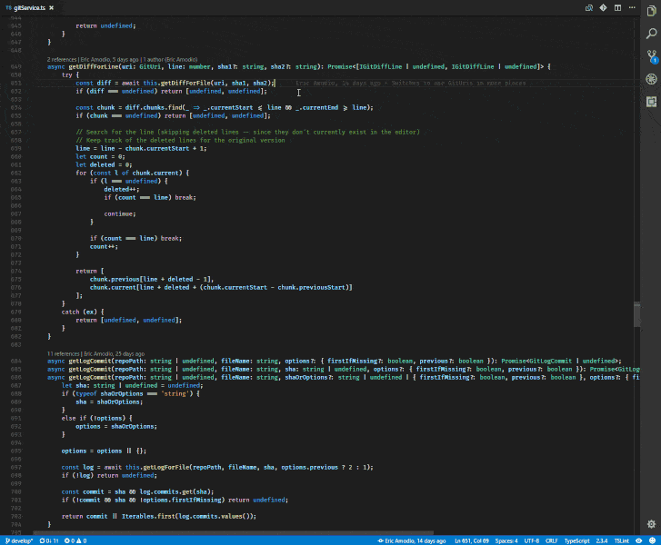](https://marketplace.visualstudio.com/items?itemName=eamodio.gitlens)

GitLens simply helps you better understand code. Quickly glimpse into whom, why, and when a line or code block was changed. Besides, it let you explore the history and evolution of a codebase effortlessly.

GitLens supercharges the Git capabilities built into Visual Studio Code. It also helps you to visualize code authorship at a glance via Git blame annotations and code lens, seamlessly navigate and explore Git repositories, gain valuable insights via powerful comparison commands, and so much more.

Downloads: 5,972,117

##### <a id="2-prettier-code-formatter"></a>[](#2-prettier-code-formatter)2\. [PRETTIER – CODE FORMATTER](https://marketplace.visualstudio.com/items?itemName=esbenp.prettier-vscode)

[](https://marketplace.visualstudio.com/items?itemName=esbenp.prettier-vscode)

It is an opinionated code formatter that enforces a consistent style by parsing your code and re-printing it with its own rules that take the maximum line length into account, wrapping code when necessary. Besides, it supports many languages. It can be integrated with the most editor.

Downloads: 7,676,738

##### <a id="3-eslint"></a>[](#3-eslint)3\. [ESLINT](https://marketplace.visualstudio.com/items?itemName=dbaeumer.vscode-eslint)

[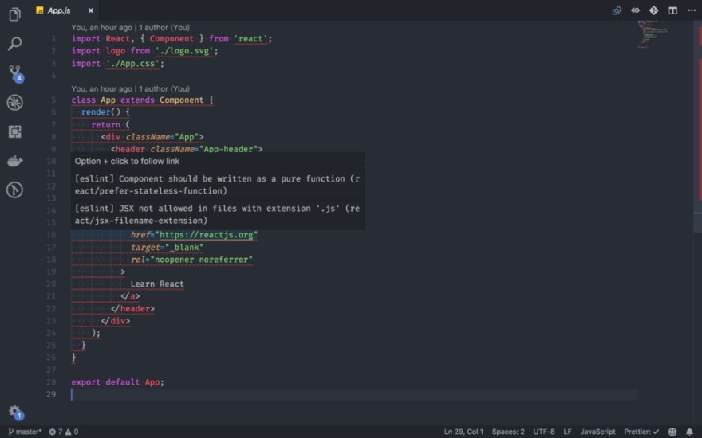](https://themeselection.com/wp-content/uploads/2020/08/12-ESLint-1024x640-2.png)

ESLint statically analyzes your code to quickly find problems. ESLint statically analyzes your code to quickly find problems. It is built into most text editors and you can run ESLint as part of your continuous integration pipeline. ESLint fixes are syntax-aware so you won’t experience errors introduced by traditional find-and-replace algorithms.

Downloads: 10,236,293

##### <a id="4-quokkajs"></a>[](#4-quokkajs)4\. [QUOKKA.JS](https://marketplace.visualstudio.com/items?itemName=WallabyJs.quokka-vscode)

[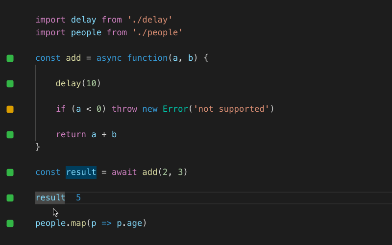](https://marketplace.visualstudio.com/items?itemName=WallabyJs.quokka-vscode)

Quokka.js is a developer productivity tool for rapid JavaScript / TypeScript prototyping. Runtime values are updated and displayed in your IDE next to your code, as you type. It makes **prototyping, learning, and testing** JavaScript / TypeScript **blazingly fast**. By default no config is required, simply open a new Quokka file and start experimenting

Downloads: 754,978

##### <a id="5-path-intellisence"></a>[](#5-path-intellisence)5\. [PATH INTELLISENCE](https://marketplace.visualstudio.com/items?itemName=christian-kohler.path-intellisense)

[](https://marketplace.visualstudio.com/items?itemName=christian-kohler.path-intellisense)

It adds Intellisense-style completion to filenames, letting you easily type long path names. It removes the file extension by default if the statement is an import statement
Downloads: 3,318,156

##### <a id="6-path-autocomplete"></a>[](#6-path-autocomplete)6\. [PATH AUTOCOMPLETE](https://marketplace.visualstudio.com/items?itemName=ionutvmi.path-autocomplete)

[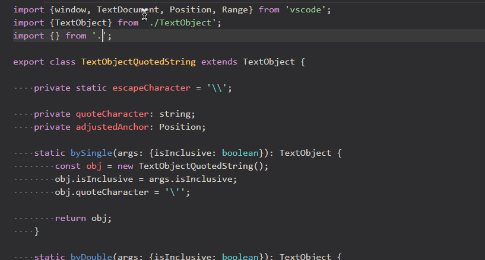](https://marketplace.visualstudio.com/items?itemName=ionutvmi.path-autocomplete)

This extension provides path completion for VS Code so you don’t have to memorize those long paths.
Downloads: 558,868

##### <a id="7-visual-studio-intellicode"></a>[](#7-visual-studio-intellicode)7\. [VISUAL STUDIO INTELLICODE](https://marketplace.visualstudio.com/items?itemName=VisualStudioExptTeam.vscodeintellicode)

[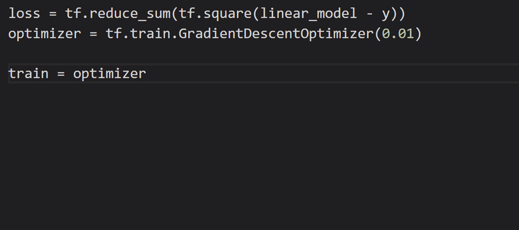](https://marketplace.visualstudio.com/items?itemName=VisualStudioExptTeam.vscodeintellicode)

It is built for helping developers and programmers with smart code completion suggestions. Also, it comes with default support for Python, TypeScript/JavaScript, React, and Java. IntelliCode saves you time by putting what you’re most likely to use at the top of your completion list. IntelliCode recommendations are based on thousands of open source projects on GitHub each with over 100 stars. When combined with the context of your code, the completion list is tailored to promote common practices.

Downloads: 6,401,943

##### <a id="8-import-cost"></a>[](#8-import-cost)8\. [IMPORT COST](https://marketplace.visualstudio.com/items?itemName=wix.vscode-import-cost)

[](https://marketplace.visualstudio.com/items?itemName=wix.vscode-import-cost)

This extension will display inline in the editor the size of the imported package. The extension utilizes webpack with babili-webpack-plugin in order to detect the imported size.

Downloads: 710,298

##### <a id="9-filesize"></a>[](#9-filesize)9\. [FILESIZE](https://marketplace.visualstudio.com/items?itemName=mkxml.vscode-filesize)

[](https://marketplace.visualstudio.com/items?itemName=mkxml.vscode-filesize)

It displays the size of the focused file in the status bar of the editor.
Downloads: 198,807

##### <a id="10-live-server"></a>[](#10-live-server)10\. [LIVE SERVER](https://marketplace.visualstudio.com/items?itemName=ritwickdey.LiveServer)

[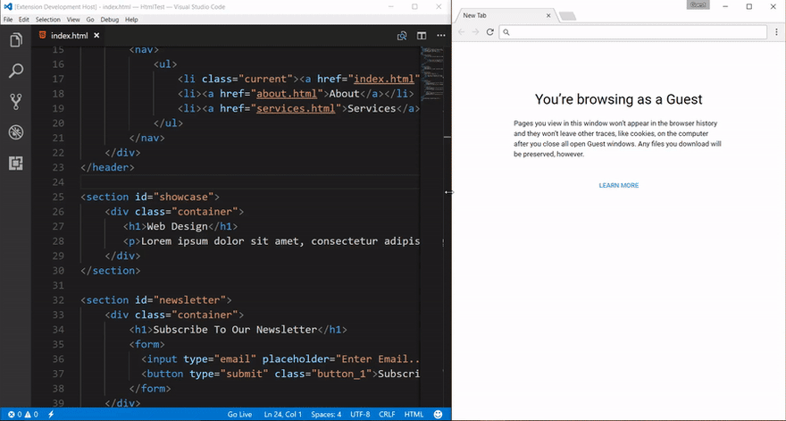](https://marketplace.visualstudio.com/items?itemName=ritwickdey.LiveServer)

Launch a development local Server by a single click and watch live changes with some extra functionality
Downloads: 6,541,468

##### <a id="11-project-manager"></a>[](#11-project-manager)11\. [PROJECT MANAGER](https://marketplace.visualstudio.com/items?itemName=alefragnani.project-manager)

[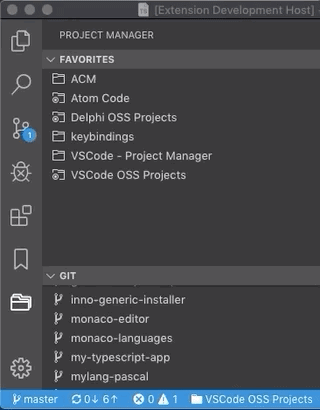](https://marketplace.visualstudio.com/items?itemName=alefragnani.project-manager)

It helps you to easily access your projects, no matter where they are located. Don’t miss those important projects anymore.
Downloads: 1,090,254

##### <a id="12-code-spell-checker"></a>[](#12-code-spell-checker)12\. [CODE SPELL CHECKER](https://marketplace.visualstudio.com/items?itemName=streetsidesoftware.code-spell-checker)

[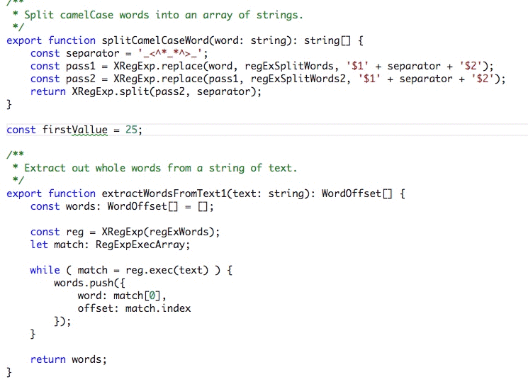](https://marketplace.visualstudio.com/items?itemName=streetsidesoftware.code-spell-checker)

A simple source code spell checker for multiple programming languages.
Downloads: 1,596,862

##### <a id="13-bracket-pair-colorizer"></a>[](#13-bracket-pair-colorizer)13\. [BRACKET PAIR COLORIZER](https://marketplace.visualstudio.com/items?itemName=CoenraadS.bracket-pair-colorizer)

[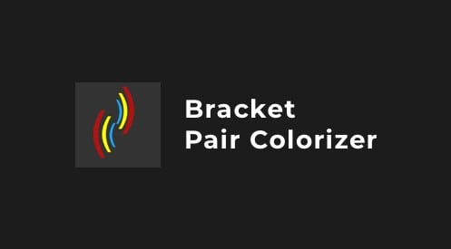](https://marketplace.visualstudio.com/items?itemName=CoenraadS.bracket-pair-colorizer)

This extension allows matching brackets to be identified with colors. The user can define which tokens to match, and which colors to use.
Downloads: 1,154,226

##### <a id="14-remote-ssh"></a>[](#14-remote-ssh)14\. [REMOTE — SSH](https://marketplace.visualstudio.com/items?itemName=ms-vscode-remote.remote-ssh)

[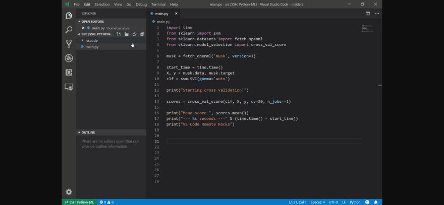](https://marketplace.visualstudio.com/items?itemName=ms-vscode-remote.remote-ssh)

The Remote – SSH extension lets you use any remote machine with an SSH server as your development environment.
Downloads: 1,605,734

##### <a id="15-rest-client"></a>[](#15-rest-client)15\. [REST CLIENT](https://marketplace.visualstudio.com/items?itemName=humao.rest-client)

[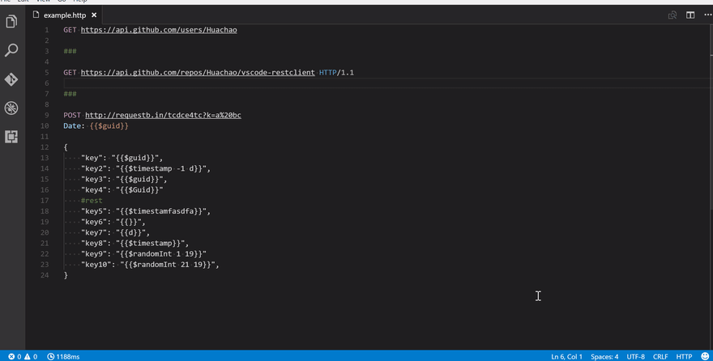](https://marketplace.visualstudio.com/items?itemName=humao.rest-client)

REST Client allows you to send HTTP requests and view the response in the Visual Studio Code directly.
Downloads: 1,025,700

##### <a id="16-javascript-es6-code-snippets"></a>[](#16-javascript-es6-code-snippets)16\. [JAVASCRIPT (ES6) CODE SNIPPETS](https://marketplace.visualstudio.com/items?itemName=xabikos.JavaScriptSnippets)

[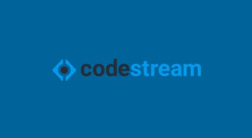](https://marketplace.visualstudio.com/items?itemName=xabikos.JavaScriptSnippets)

This extension contains code snippets for JavaScript in ES6 syntax for Vs Code editor (supports both JavaScript and TypeScript).
Downloads: 3,789,793

##### <a id="17-code-runner"></a>[](#17-code-runner)17\. [CODE RUNNER](https://marketplace.visualstudio.com/items?itemName=formulahendry.code-runner)

[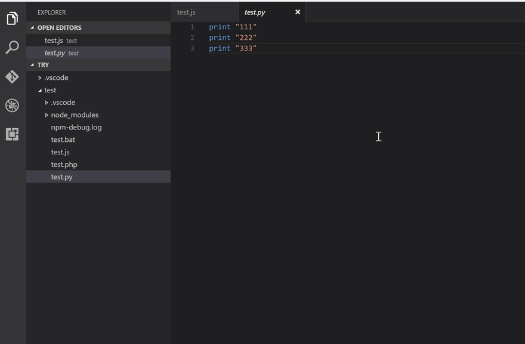](https://marketplace.visualstudio.com/items?itemName=formulahendry.code-runner)

Code Runner is a run code snippet or code file for multiple languages. It is useful to run the code file of the currently active text editor, through the context menu of file explorer. Also, you can run selected code snippets in the text editor. It supports REPL by running code in Integrated terminal

Downloads: 4,549,546

##### <a id="18-docker"></a>[](#18-docker)18\. [DOCKER](https://marketplace.visualstudio.com/items?itemName=ms-azuretools.vscode-docker)

[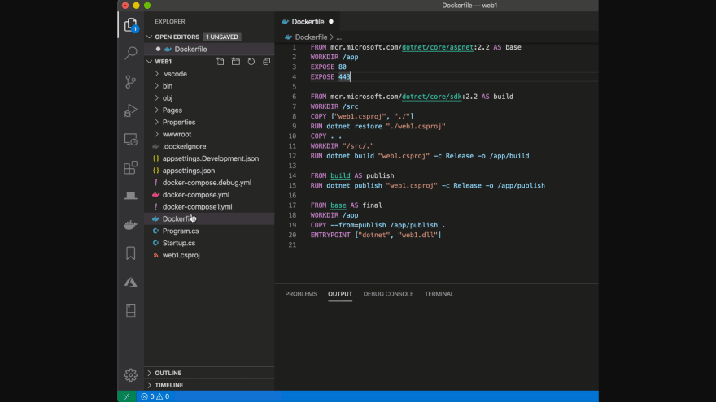](https://marketplace.visualstudio.com/items?itemName=ms-azuretools.vscode-docker)

The Docker extension makes it easy to build, manage, and deploy containerized applications from Visual Studio Code. It also provides one-click debugging of Node.js, Python, and .NET Core inside a container. The extension recognizes workspaces that use most popular development languages (C#, Node.js, Python, Ruby, Go, and Java) and customizes generated Docker files accordingly. The Docker extension contributes a Docker view to VS Code. The Docker view lets you examine and manage Docker assets: containers, images, volumes, networks, and container registries

Downloads: 5,136,014

##### <a id="19-better-comments"></a>[](#19-better-comments)19\. [BETTER COMMENTS](https://marketplace.visualstudio.com/items?itemName=aaron-bond.better-comments)

[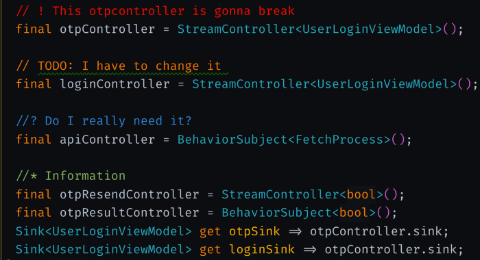](https://marketplace.visualstudio.com/items?itemName=aaron-bond.better-comments)

The Better Comments extension will help you create more human-friendly comments in your code. You will be able to categorize your annotations into alerts, queries, TODOs, highlights, etc. Besides, commented out code can also be styled to make it clear the code shouldn’t be there, and any other comment styles you’d like can be specified in the settings.

Downloads: 960,927

##### <a id="20-debugger-for-chrome"></a>[](#20-debugger-for-chrome)20\. [DEBUGGER FOR CHROME](https://marketplace.visualstudio.com/items?itemName=msjsdiag.debugger-for-chrome)

[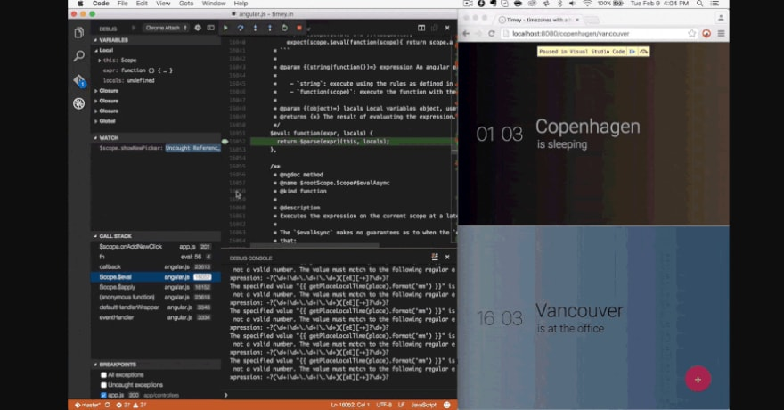](https://marketplace.visualstudio.com/items?itemName=msjsdiag.debugger-for-chrome)

The debugger is a VS Code extension to debug your JavaScript code in the Google Chrome browser or other targets that support the Chrome DevTools Protocol. It helps to debug eval scripts, script tags, scripts that are added dynamically, and setting breakpoints, including in source files when source maps are enabled.

Downloads: 1,617,311

##### <a id="21-markdown-all-in-one"></a>[](#21-markdown-all-in-one)21\. [MARKDOWN ALL IN ONE](https://marketplace.visualstudio.com/items?itemName=yzhang.markdown-all-in-one)

[](https://marketplace.visualstudio.com/items?itemName=yzhang.markdown-all-in-one)

All you need for Markdown (keyboard shortcuts, table of contents, auto preview, and more). It supports the following markdown syntax:

- [CommonMark](https://spec.commonmark.org/)
- [Tables](https://help.github.com/articles/organizing-information-with-tables/), [strikethrough](https://help.github.com/articles/basic-writing-and-formatting-syntax/#styling-text) and [task lists](https://docs.github.com/en/github/writing-on-github/basic-writing-and-formatting-syntax#task-lists) (from GitHub Flavored Markdown)
- [Math support](https://github.com/waylonflinn/markdown-it-katex#syntax) (from KaTeX)
- [Front matter](https://github.com/ParkSB/markdown-it-front-matter#valid-front-matter)

Downloads: 5,136,014

##### <a id="22-search-nodemodules"></a>[](#22-search-nodemodules)22\. [SEARCH NODE_MODULES](https://marketplace.visualstudio.com/items?itemName=jasonnutter.search-node-modules)

[](https://marketplace.visualstudio.com/items?itemName=jasonnutter.search-node-modules)
Search node modules is a simple plugin for VS Code that allows you to quickly navigate the file inside your project’s node_modules directory.

Downloads: 571,040

##### <a id="23-settings-sync"></a>[](#23-settings-sync)23\. [SETTINGS SYNC](https://marketplace.visualstudio.com/items?itemName=Shan.code-settings-sync)

[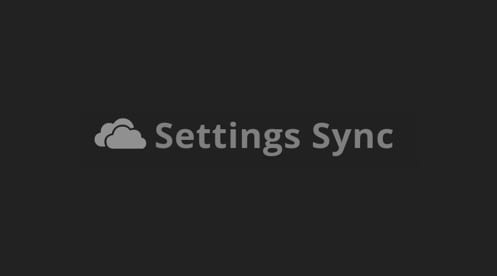](https://marketplace.visualstudio.com/items?itemName=Shan.code-settings-sync)

Setting sync lets you synchronize settings, snippets, themes, file icons, keybindings, workspaces, and extensions across machines by using a simple Gist. It supports GitHub Enterprise, pragmas with @sync keywords: host, os, and env. It is easy to Upload and Download on one click. It allows you to Sync any file across your machines.

Downloads: 1,870,161

##### <a id="24-npm"></a>[](#24-npm)24\. [NPM](https://marketplace.visualstudio.com/items?itemName=eg2.vscode-npm-script)

[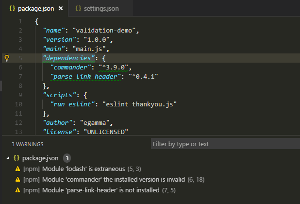](https://marketplace.visualstudio.com/items?itemName=eg2.vscode-npm-script)

This extension supports running npm scripts defined in the package.json file and validating the installed modules against the dependencies defined in the package.json. The scripts can be run either in the integrated terminal or an output window.

Downloads: 2,748,322

#### <a id="conclusion"></a>[](#conclusion)Conclusion:

Well, Visual Studio Code had 4.9 million monthly active users in 2019. It is no doubt the best code editor out there at the moment. One of the best features is the [**Market Place**](https://marketplace.visualstudio.com/vscode) offering tons of extensions to customize it exactly to your needs and helping you in writing high-quality code.

In this article, we will recommend these VS Code extensions for front-end engineers working with CSS, HTML, JavaScript, and frameworks like Angular, ReactJS, and VueJS.
We at [ThemeSelection](https://themeselection.com/) is using some of these extensions to create Modern & Clean Bootstrap Admin Template.

[Vuexy - Vuejs, React, HTML & Laravel Admin Dashboard Template](https://themeselection.com/go/download-vuexy-vuejs/)

[Apex - React Admin Template with Bootstrap + Redux](https://themeselection.com/go/download-apex-react/)

[Chamaleon Free Bootstrap Admin Template](https://themeselection.com/products/chameleon-admin-free-bootstrap-dashboard-template/)

You can also check some [free bootstrap admin template](https://themeselection.com/) made using these extensions.

We would say this collection is not the complete one and the extensions are not necessarily the best but we hope it helps you to select the best tools to help you write high-quality code and become the best web developer.

If you think this list is missing an extension feel free to suggest and extend it by adding your favorite in the comments section.

## Discussion (26)


Collapse

[](https://dev.to/king11)

[Lakshya Singh](https://dev.to/king11) • [Aug 24 '20](https://dev.to/king11/comment/142no)

Thanks for this post it's really amazing although I do feel that settings sync is no more needed because in latest vscode update they have started providing it by default

[Comment button Reply](#/theme_selection/vs-codes-every-developers-should-use-in-2020-2fa3/comments/new/142no)

Collapse

[](https://dev.to/theme_selection)

[themeselection Author](https://dev.to/theme_selection) • [Aug 24 '20](https://dev.to/theme_selection/comment/142o6)

Is it available now in the latest versions? I have heard about that that they will be going to provide it built-in.

[Comment button Reply](#/theme_selection/vs-codes-every-developers-should-use-in-2020-2fa3/comments/new/142o6)

Collapse

[](https://dev.to/king11)

[Lakshya Singh](https://dev.to/king11) • [Aug 24 '20 • Edited on Aug 24](https://dev.to/king11/comment/142o7)

Yeah it rolled out in july release i guess and i recently started using it

Thread Thread

[](https://dev.to/theme_selection)

[themeselection Author](https://dev.to/theme_selection) • [Aug 24 '20](https://dev.to/theme_selection/comment/142ob)

Great! I wasn't aware. Let me try and will update the post accordingly.

[Comment button Reply](#/theme_selection/vs-codes-every-developers-should-use-in-2020-2fa3/comments/new/142ob)

Collapse

[](https://dev.to/andreabaccolini)

[Andrea](https://dev.to/andreabaccolini) • [Aug 28 '20](https://dev.to/andreabaccolini/comment/1471i)

It is released but it is a preview feature

[Comment button Reply](#/theme_selection/vs-codes-every-developers-should-use-in-2020-2fa3/comments/new/1471i)

Collapse

[](https://dev.to/vrushank)

[vrushank](https://dev.to/vrushank) • [Aug 24 '20 • Edited on Aug 24](https://dev.to/vrushank/comment/142p3)

I agree!! Have you tried the default settings sync by vscode? How efficient and reliable is that?

[Comment button Reply](#/theme_selection/vs-codes-every-developers-should-use-in-2020-2fa3/comments/new/142p3)

Collapse

[](https://dev.to/king11)

[Lakshya Singh](https://dev.to/king11) • [Aug 25 '20 • Edited on Aug 25](https://dev.to/king11/comment/143pi)

Yeah i guess it's cool although i am yet to try how the sync works when i switch or remove my OS and reinstall VS code but atleast you don't see that terminal opening up again and again telling you its uploading your new settings

Thread Thread

[](https://dev.to/michaelcurrin)

[Michael](https://dev.to/michaelcurrin) • [Aug 29 '20](https://dev.to/michaelcurrin/comment/147oa)

The older extension has quiet mode! Try it out in settings.json

Thread Thread

[](https://dev.to/king11)

[Lakshya Singh](https://dev.to/king11) • [Aug 29 '20](https://dev.to/king11/comment/1485h)

Ohh thanks for informing

Thread Thread

[](https://dev.to/michaelcurrin)

[Michael](https://dev.to/michaelcurrin) • [Aug 29 '20](https://dev.to/michaelcurrin/comment/1488o)

```
{  "sync.quietSync":  true  } 
```

[Comment button Reply](#/theme_selection/vs-codes-every-developers-should-use-in-2020-2fa3/comments/new/1488o)

Collapse

[](https://dev.to/awesomeironman)

[Cyrus Gracias](https://dev.to/awesomeironman) • [Aug 24 '20](https://dev.to/awesomeironman/comment/1434d)

Try "Tab Nine" Extension which provides better intellisense/faster code complete
They say it uses ML
I find it provides very accurate predictions

[Comment button Reply](#/theme_selection/vs-codes-every-developers-should-use-in-2020-2fa3/comments/new/1434d)

Collapse

[](https://dev.to/nasimuddin)

[Nasim Uddin](https://dev.to/nasimuddin) • [Aug 27 '20](https://dev.to/nasimuddin/comment/145hg)

But the only problem of " Tab Nine" is it uses too much memory. Otherwise it's a cool code completion extension.

[Comment button Reply](#/theme_selection/vs-codes-every-developers-should-use-in-2020-2fa3/comments/new/145hg)

Collapse

[](https://dev.to/awesomeironman)

[Cyrus Gracias](https://dev.to/awesomeironman) • [Aug 27 '20](https://dev.to/awesomeironman/comment/145hi)

Ohh I didn't any face memory issues while working with it
I have 8GB ram with chrome, vscode, other small tools open at all times
And I'm working on a big website project

Thread Thread

[](https://dev.to/nasimuddin)

[Nasim Uddin](https://dev.to/nasimuddin) • [Aug 27 '20](https://dev.to/nasimuddin/comment/145hl)

Don't know why I had faced this problem. Ok I will try Tab Nine again, thanks😊

[Comment button Reply](#/theme_selection/vs-codes-every-developers-should-use-in-2020-2fa3/comments/new/145hl)

Collapse

[](https://dev.to/robole)

[Rob OLeary](https://dev.to/robole) • [Aug 25 '20 • Edited on Sep 11](https://dev.to/robole/comment/1445m)

Markdown All in One is a bit too much of a kitchen sink approach for my taste. If you just want to choose specific extensions for what you need in markdown, try the following:

- [Marky Dynamic](https://marketplace.visualstudio.com/items?itemName=robole.marky-dynamic): Table of Contents and other dynamic content. It will auto-update on save.
- [Markdown Snippets](https://marketplace.visualstudio.com/items?itemName=robole.markdown-snippets): Extended Markdown snippets for quickly adding tables and task lists.
- [Marky Edit](https://marketplace.visualstudio.com/items?itemName=robole.marky-edit): Toggle-style editing.

[Comment button Reply](#/theme_selection/vs-codes-every-developers-should-use-in-2020-2fa3/comments/new/1445m)

Collapse

[](https://dev.to/enguerran)

[enguerran 🐐💨](https://dev.to/enguerran) • [Aug 26 '20](https://dev.to/enguerran/comment/1453g)

Thank you for the selection. Some were already in my installed list (this is a proof of the selection quality 😋).

By the way, the author of Bracket Pair Colorizer recommends v2: [marketplace.visualstudio.com/items...](https://marketplace.visualstudio.com/items?itemName=CoenraadS.bracket-pair-colorizer-2)

> - Differences between v1 and v2?
>     - v2 Uses the same bracket parsing engine as VSCode, **greatly increasing speed and accuracy**. A new version was released because settings were cleaned up, breaking backwards compatibility.

[Comment button Reply](#/theme_selection/vs-codes-every-developers-should-use-in-2020-2fa3/comments/new/1453g)

Collapse

[](https://dev.to/valeriopisapia)

[Valerio](https://dev.to/valeriopisapia) • [Aug 28 '20](https://dev.to/valeriopisapia/comment/1470e)

Awesome thanks 😊

[Comment button Reply](#/theme_selection/vs-codes-every-developers-should-use-in-2020-2fa3/comments/new/1470e)

Collapse

[](https://dev.to/theme_selection)

[themeselection Author](https://dev.to/theme_selection) • [Aug 28 '20](https://dev.to/theme_selection/comment/1471f)

Welcome 🙏

[Comment button Reply](#/theme_selection/vs-codes-every-developers-should-use-in-2020-2fa3/comments/new/1471f)

Collapse

[](https://dev.to/madza)

[Madza](https://dev.to/madza) • [Aug 25 '20](https://dev.to/madza/comment/143g9)

awesome list 👌
be careful with Quokka tho, as you can mess up the code pretty quickly if you experiment with it in different parts of code simultaneously 😉

[Comment button Reply](#/theme_selection/vs-codes-every-developers-should-use-in-2020-2fa3/comments/new/143g9)

Collapse

[](https://dev.to/theme_selection)

[themeselection Author](https://dev.to/theme_selection) • [Aug 25 '20](https://dev.to/theme_selection/comment/143kc)

Thanks, Madza, for sharing your thoughts and experience with Quokka.

[Comment button Reply](#/theme_selection/vs-codes-every-developers-should-use-in-2020-2fa3/comments/new/143kc)

Collapse

[](https://dev.to/tjjone98)

[Vu](https://dev.to/tjjone98) • [Nov 14 '20](https://dev.to/tjjone98/comment/181cf)

If you want watch time log of project, language, time code in the day, the week, I recommend Waka plugin. Error Lens plugin: Improve highlighting of errors, warnings and other language diagnostics.

[Comment button Reply](#/theme_selection/vs-codes-every-developers-should-use-in-2020-2fa3/comments/new/181cf)

Collapse

[](https://dev.to/andrewbaisden)

[Andrew Baisden](https://dev.to/andrewbaisden) • [Aug 28 '20](https://dev.to/andrewbaisden/comment/147cb)

Great article I already have a few of them installed.

[Comment button Reply](#/theme_selection/vs-codes-every-developers-should-use-in-2020-2fa3/comments/new/147cb)

Collapse

[](https://dev.to/michaelcurrin)

[Michael](https://dev.to/michaelcurrin) • [Aug 29 '20](https://dev.to/michaelcurrin/comment/14824)

Thanks for sharing.

I cover most of those in my list here though without the GIFs.

[gist.github.com/MichaelCurrin/e1f0...](https://gist.github.com/MichaelCurrin/e1f0b488d4ed8e6c24646e37c75fe2ea)

[Comment button Reply](#/theme_selection/vs-codes-every-developers-should-use-in-2020-2fa3/comments/new/14824)

Collapse

[](https://dev.to/ronsoak)

[ronsoak](https://dev.to/ronsoak) • [Aug 26 '20](https://dev.to/ronsoak/comment/145fo)

Amazing Article, have downloaded a few :)

[Comment button Reply](#/theme_selection/vs-codes-every-developers-should-use-in-2020-2fa3/comments/new/145fo)

Collapse

[](https://dev.to/xmariopereira)

[Mario Pereira](https://dev.to/xmariopereira) • [Aug 25 '20](https://dev.to/xmariopereira/comment/14489)

Still I can’t run unit test like webstorm :/

[Comment button Reply](#/theme_selection/vs-codes-every-developers-should-use-in-2020-2fa3/comments/new/14489)

Collapse

[](https://dev.to/tomaszs2)

[Tomasz Smykowski](https://dev.to/tomaszs2) • [Jan 30](https://dev.to/tomaszs2/comment/1b2b9)

Did you hear about Assistant? [dev.to/tomaszs2/i-ve-wrote-an-exte...](https://dev.to/tomaszs2/i-ve-wrote-an-extension-so-you-don-t-have-to-google-5485)

[Comment button Reply](#/theme_selection/vs-codes-every-developers-should-use-in-2020-2fa3/comments/new/1b2b9)

[Code of Conduct](https://dev.to/code-of-conduct) • [Report abuse](https://dev.to/report-abuse)

## Read next

[<br>### Underrated Articles on Dev.to from Last Week<br>Manpreet virk - Mar 9](https://dev.to/xenoxdev/underrated-articles-on-dev-to-from-last-week-4hgg)[<br>### You don't know the classNames library<br>Arek Nawo - Mar 10](https://dev.to/areknawo/you-don-t-know-the-classnames-library-k3n)[<br>### Top 10 VS Code Extensions to level up your development game<br>Sparsh Agarwal - Mar 11](https://dev.to/akathecoder/top-10-vs-code-extensions-to-level-up-your-development-game-18i)[<br>### Top 10 Date Pickers in React<br>deji adesoga - Mar 10](https://dev.to/desoga/top-10-date-pickers-in-react-9hm)

[themeselection](https://dev.to/theme_selection)

ThemeSelection provide selected high quality, modern design, professional and easy-to-use Bootstrap HTML Themes, Admin Dashboard Template and UI Kits to create your applications faster!

- Joined
    
    Jan 3, 2020
    

### More from [themeselection](https://dev.to/theme_selection)

[Which PHP Framework 🛠 Is Best For Web Development In 2021?💥<br>#webdev #programming #php #tutorial](https://dev.to/theme_selection/which-php-framework-is-best-for-web-development-in-2021-5ck5)[How to use Exemplar - Free Avatar Library?🤩<br>#tutorial #design #opensource #html](https://dev.to/theme_selection/how-to-use-exemplar-free-avatar-library-1okp)[Bootstrap 5 CheatSheet By ThemeSelection! 🚀<br>#beginners #webdev #javascript #css](https://dev.to/theme_selection/bootstrap-5-cheatsheet-by-themeselection-2llg)

[Home](https://dev.to/) [Listings](https://dev.to/listings) [Podcasts](https://dev.to/pod) [Videos](https://dev.to/videos) [Tags](https://dev.to/tags) [Code of Conduct](https://dev.to/code-of-conduct) [FAQ](https://dev.to/faq) [DEV Shop](https://shop.dev.to/) [Sponsors](https://dev.to/sponsors) [About](https://dev.to/about) [Privacy Policy](https://dev.to/privacy) [Terms of use](https://dev.to/terms) [Contact](https://dev.to/contact) [Sign In/Up](https://dev.to/enter)

[Twitter](https://twitter.com/thepracticaldev) [Facebook](https://facebook.com/thepracticaldev) [Github](https://github.com/thepracticaldev) [Instagram](https://instagram.com/thepracticaldev) [Twitch](https://twitch.com/thepracticaldev)

* * *

[DEV Community](https://dev.to/) – A constructive and inclusive social network for software developers. With you every step of your journey.

Built on [Forem](https://www.forem.com) — the [open source](https://dev.to/t/opensource) software that powers [DEV](https://dev.to) and other inclusive communities.

Made with love and [Ruby on Rails](https://dev.to/t/rails). DEV Community © 2016 - 2021.

[Forem logo](https://www.forem.com)

