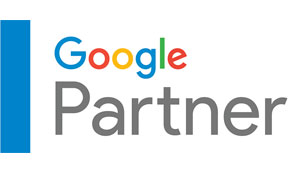

 

- [Request For Quote](https://www.skynetindia.info/inquiry.html "Request For Quote")

- [Website Design](https://www.skynetindia.info/website-design.html "Website Design")
- [Website Maintenance](https://www.skynetindia.info/website-maintenance.html "Website Maintenance")
- [Web Development](https://www.skynetindia.info/web-development-india.html "Web Development")
- [SEO Services](https://www.skynetindia.info/seo-packages.html "SEO Services")
- [Mobile App Development](https://www.skynetindia.info/mobile-application-development.html "Mobile App Development")
- Company
- [Contact](https://www.skynetindia.info/contactus.html "Contact Web Design Company India")

## **Setting Up your Gmail Account in Microsoft Outlook 2007**

Let Us Help You To Setting Up Your E-Mail Account In Outlook!

1.  [Home](https://www.skynetindia.info/index.html "Home")
2.  [Setting up your E-mail Account in Outlook](https://www.skynetindia.info/tips-to-configure-outlook.html "Tips to configure Outlook")
3.  Gmail Account in Microsoft Outlook 2007

# Setting up your Gmail Account in Microsoft Outlook 2007

This tutorial shows you how to set up Microsoft Outlook 2007 to work with your Gmail account. This tutorial focuses on setting up Microsoft Outlook 2007, but these settings are similar in other versions of Microsoft Outlook Express. You can set up previous versions of Microsoft Outlook Express by using the settings in this tutorial.

## To Set Up Your Gmail Account in Microsoft Outlook 2007

First we need to make sure your Gmail account is set up to enable POP (Post Office Protocol). In Gmail just go to mail settings and choose the Forwarding and POP tab. Click on one of the options to enable POP.

Update: Note the drop-down that says what to do when mail is accessed with POP3. Please do NOT change this to "Delete".

Click on Save Changes Button

**1\.** Now open up Outlook 2007 and go to Tools \ Account Settings.

**2\.** Under Account Settings choose the E-mail tab and click on New.

**3\.** Enter in all of your Gmail account information \*\*make sure there is no check next to Manually configure server.\*\* You do not have to go through these extra steps. Just click on Next.

**4\.** After Outlook has successfully configured the e-mail server settings you can go ahead and click Finish.

**Go back to your inbox and hit send/receive and you are done!**

### If this doesn't work

If you are having problems with the automatic setup, you'll need to choose the "Manually Configure Server" option, and then fill in your details as follows:

Here are the important settings:

- **Email Address:** Your full Gmail address
- **Incoming Mail Server:** pop.gmail.com
- **Outgoing Mail Server:** smtp.gmail.com (Note: If you have problems with sending email you may have to check with your internet provider, as they often require you to send email through their system.
- **User Name:** Your full Gmail email address

Now you'll need to click on the More Settings. button, and check the box on the Outgoing Server tab for "My outgoing server requires authentication"

Now switch to the Advanced tab, and check the box that says "This server requires an encrypted connection", then change the fields to match these values:

- **Incoming Server:** 995
- Check the box for "This server requires an encrypted connection"
- **Outgoing Server (SMTP):** 587
- Change the type of encrypted connection to Auto, or use TLS if you have problems.

Close the dialogs and go through the rest of the wizard and everything should be working.

Previous Slide Next Slide

Subscribe to Our Newsletter!

Join us to stay updated with our latest blog updates, marketing tips, service tips, trends, news and announcements!

Name

Email Address

About Us

- [About us](https://www.skynetindia.info/aboutus.html "About us")
- [About Jamnagar](https://www.skynetindia.info/about-jamnagar.html "About Jamnagar")
- [Quality Policy](https://www.skynetindia.info/quality-policy.html "Quality Policy")
- [Contact Us](https://www.skynetindia.info/contactus.html "Contact Skynet INDIA")
- [Blog](https://www.skynetindia.info/blog/ "Blog")
- [Imprint](https://www.skynetindia.info/imprint.html "Imprint")
- [Sitemap](https://www.skynetindia.info/sitemap.xml "Skyent Technologies India Sitemap")

Important Links

- [Payments](https://www.skynetindia.info/payment.html "How to Pay for Web Design India")
- [FAQ](https://www.skynetindia.info/faqs.html "FAQ")
- [How to configure Outlook](https://www.skynetindia.info/tips-to-configure-outlook.html "How to Configure Outlook 2007")
- [Careers](https://www.skynetindia.info/careers.html "Career in IT Company India")
- [Network Consultancy Services](https://www.skynetindia.info/network-consultancy-services.html "Network Consultancy Services")
- [Web Designing India](https://www.skynetindia.info/website-design.html "Web Design India")
- [Corporate Mailing Solutions](https://www.skynetindia.info/corporate-mailing-solution.html "Corporate Mailing Solutions")

Offices

-  [ USA - Ohio](https://www.skynetindia.info/contactus.html?continent=north%20america&country=united%20states&region=oh) 
-  [ USA - Nevada](https://www.skynetindia.info/contactus.html?continent=north%20america&country=united%20states&region=nv)
-  [ USA - Florida](https://www.skynetindia.info/contactus.html?continent=north%20america&country=united%20states&region=fl)
- [INDIA - Gujarat](https://www.skynetindia.info/contactus.html?continent=asia&country=india&region=all)
-  [ AUSTRALIA - Victoria](https://www.skynetindia.info/contactus.html?continent=oceania&country=australia&region=all)

Customer Base

Los Angeles Long Beach Anaheim, LA CA, Chicago Naperville Elgin, Dallas-Fort Worth Arlington, TX, Houston The Woodlands-Sugar Land, TX, Washington Arlington Alexandria, Miami-Fort Pompano Beach, FL Philadelphia Camden Wilmington, Atlanta-Sandy Springs Alpharetta, San Francisco Oakland Berkeley, Reno, NV, Gainesville, FL.

© 2002 - *2021* [Skynet Technologies USA LLC.](https://www.skynetindia.info "Website Design India") 27 Heron Drive, Amelia, OH, 45102. - All rights reserved.
[Terms & Conditions](https://www.skynetindia.info/termsofuse.html) | [Privacy Policy](https://www.skynetindia.info/privacy.html) | [Disclaimer](https://www.skynetindia.info/disclaimer.html) | [R & C Policy](https://www.skynetindia.info/refundandcancellation.html)