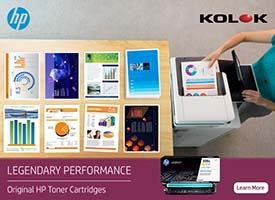
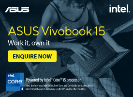
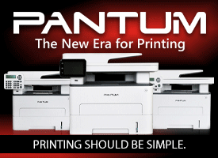
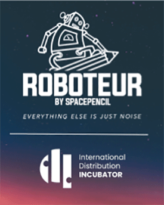
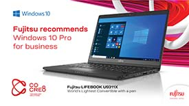

- [Home](http://www.it-online.co.za)
- [About Us](https://it-online.co.za/aboutus/)
- [Business IT](http://business-it.co.za/)
- [Channelwise](http://www.channelwise.co.za/)
- [Subscribe](http://eepurl.com/bsw-mn)

- [Africa](https://it-online.co.za/category/african/)
- [Company News](https://it-online.co.za/category/company-news/)
- [Industry Areas](https://it-online.co.za/category/industryareas/)
- [Technology Areas](https://it-online.co.za/category/technews/)
- [Mobile Lifestyle Hub](https://it-online.co.za/mobile-lifestyle-hub/)

# Off-grid solutions are making more sense to South Africans

Jun 4, 2021

With load shedding back and disrupting day to day life, compounded by consumers feeling the 15% increase on their electricity bill, alternative sources of energy are starting to look more attractive to South Africans, and solar should be at the top of the list.

By Mathew Hall, product director at Rectron

Alternative power solutions, such as solar panels, inverters, and batteries, have progressed significantly in terms of efficiency and cost over the last decade. As solar technology becomes more accessible and electrical appliances continue to reduce their power consumption, installing a solar system to supplement your electricity bill and reduce your dependence on the electrical grid has never been more appealing and easier to do.

Considering South Africa’s electricity supply issues, why don’t more homes and businesses already have solar? How expensive is implementing solar solutions within a household and when should users expect a payback from their investment?

There are other ways to reduce a home’s electricity consumption. Consider these as part of a longer-term investment and cost-saving exercise. Depending on your needs, there are multiple options and solutions which can be customised for your home, cost, and preferences.

Pure solar generation with no battery backup

With the current generation of solar inverters available today, users can install a solar system without the need for backup batteries and significantly reduces the overall cost. Ideally, this solution is for households or offices that consume more power during the day, allowing the user to maximise the electricity generated in the daytime as there is no way to store power.

A pure solar generation allows the user to generate solar with much lower capital investment and will supplement existing power available, rather than replacing it.

\* According to Eskom, the national average daily consumption for a typical household is over 30 kWh.

\* With the maximum 8 000W of panels installed, users could generate 7 290kWh a year. Based on the higher Eskom tariffs, the return per year is R22 526.

\* The total hardware cost involved for panels and the inverter is around R70 000 and around R50 000 for installation, providing a total cost of around R120 000.

\* Based on the generation figure of R22 526 the return will be 5,3 years if every kWh hour generated is used. The return on investment here will come from reducing consumption from Eskom, with users paying less on the R3.09 per kWh tariff for over 600KWh per month consumption.

The downside of this installation is of course that in event of load shedding at night or during daytime when consumption is higher than generation, there will be no backup power, which of course leads us to the next scenario.

Solar Generation with battery backup

A photovoltaic system converts the sun’s radiation, in the form of light, into usable electricity. As a backup or moving to an off-grid style solution, a photovoltaic system and a solar power storage unit, valuable solar electricity can be stored and used during times of load shedding.

As it is hard to match electricity consumption to the solar power that is being generated, you often need a battery backup so that users can store power to use at a later stage. This of course will lead to higher capital investment, with various considerations which must be taken into account.

\* On top of the R120 000 needed for the solar system, users will need a sufficient battery backup, especially for night consumption or low light times of the year.

\* The current South African household backup requirement is around 10Kwh of backup. This will require three 3.6kwh Dyness B3 Lithium Iron Phosphate batteries, leading to a total of R54 000 on top of the hardware cost above.

\* With the total cost now at R174,000, the return on investment is now 7.72 years. However, with backup batteries in place, the user is much closer to be totally off the grid and far less reliant on Eskom power supply.

When selecting the batteries which will be used within the solar system, it is important to consider their quality and capacity, rather than the initial cost of investment. Lithium Iron Phosphate batteries may be more expensive when compared to acid, AGM and Gel-based batteries. However, lithium batteries will last up to 10 years or 6000 cycles, while acid, AGM and Gel-based batteries will only last around 1200 cycles before they must be replaced.

An installer should be able to provide you with an accurate energy estimate for how much your system will produce each year, as well as how much you will save. The payback period on these scenarios is based on Eskom tariff remaining flat for the next five to seven years. With tariffs likely to continue to rise, the return period will become much shorter with each increase.

Over and above the benefit of lower electricity bills, a solar power system makes a home more environmentally friendly and limits reliance on Eskom.

Alternatives to keep the lights on during load shedding

For many South Africans, going off-grid might not be affordable and they may just be looking for solutions to ensure they can remain productive during load shedding. Once these hardware solutions have been installed within an office space or household, the adverse effects of load shedding can be completely sidestepped, ensuring you or your workforce remain productive and minimising business disruptions.

Consumer backup options include:

\* The MegaPower Bank is focused on users who need more than what a standard power bank can provide, and can power up a variety of devices. Focused at either a small home or traveling user, you should be able to power your router, notebook, and screen (details specific and uptime will vary).

\* The MegaPower Trolley is focused on households looking to cover the full load shedding time. Depending on the number of devices that are connected to the 1k Inverter with a 200ah battery, this solution is capable of keeping basic lights, TVs and devices all charged throughout load shedding.

Whether you prefer a permanent professionally installed solution or an easy plug play solution, Rectron offers a range of power solutions, including RCT and Vertiv, that can be customized for a variety of situations and needs of our customers.

### *Related*

[What to know before jumping into solar](https://it-online.co.za/2020/08/20/what-to-know-before-jumping-into-solar/?relatedposts_hit=1&relatedposts_origin=187283&relatedposts_position=0 "What to know before jumping into solar")August 20, 2020In "Power and Cooling Trends"

[Businesses look to smart solar solutions](https://it-online.co.za/2019/02/28/businesses-look-to-smart-solar-solutions/?relatedposts_hit=1&relatedposts_origin=187283&relatedposts_position=1 "Businesses look to smart solar solutions")February 28, 2019In "Power and Cooling"

[Master Power saves R9k a month with solar energy](https://it-online.co.za/2015/09/23/master-power-saves-r9k-a-month-with-solar-energy/?relatedposts_hit=1&relatedposts_origin=187283&relatedposts_position=2 "Master Power saves R9k a month with solar energy")September 23, 2015In "Power and Cooling"

<ins></ins>

<ins></ins>

<ins></ins>

<ins></ins>

<ins></ins>

<ins></ins>

<ins></ins>

<ins></ins>

<ins></ins>

- [Home](http://www.it-online.co.za)
- [About Us](https://it-online.co.za/aboutus/)
- [Business IT](http://business-it.co.za/)
- [Channelwise](http://www.channelwise.co.za/)
- [Subscribe](http://eepurl.com/bsw-mn)

Designed by [Elegant Themes](http://www.elegantthemes.com "Premium WordPress Themes") | Powered by [WordPress](http://www.wordpress.org)