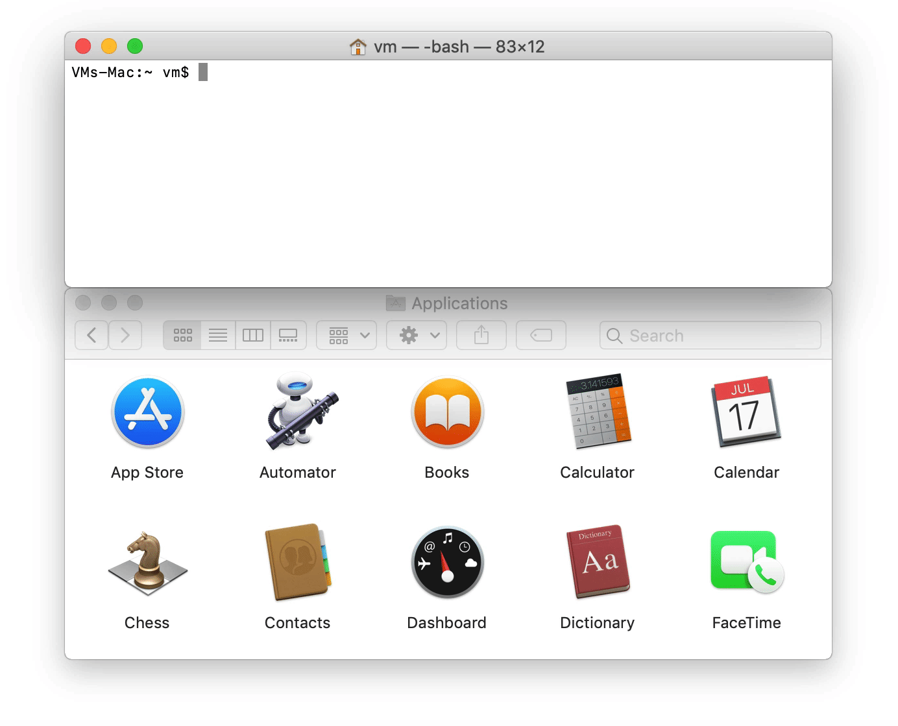

[Skip to content](#start-of-content)


[Pull requests](https://github.com/pulls) [Issues](https://github.com/issues)

[Marketplace](https://github.com/marketplace)

[Explore](https://github.com/explore)


# [Homebrew](https://github.com/Homebrew) / **[homebrew-cask](https://github.com/Homebrew/homebrew-cask)**

- Sponsor
- Watch [315](https://github.com/Homebrew/homebrew-cask/watchers)
- [18k](https://github.com/Homebrew/homebrew-cask/stargazers)
    
- Fork
    
    [9k](https://github.com/Homebrew/homebrew-cask/network/members)

- [Code](https://github.com/Homebrew/homebrew-cask)
- [Issues 24](https://github.com/Homebrew/homebrew-cask/issues)
- [Pull requests 33](https://github.com/Homebrew/homebrew-cask/pulls)
- [Actions](https://github.com/Homebrew/homebrew-cask/actions)
- [Security](https://github.com/Homebrew/homebrew-cask/security)
- [Insights](https://github.com/Homebrew/homebrew-cask/pulse)

master

[**3** branches](https://github.com/Homebrew/homebrew-cask/branches) [**130** tags](https://github.com/Homebrew/homebrew-cask/tags)

[Go to file](https://github.com/Homebrew/homebrew-cask/find/master) Add file Code

## Latest commit

[](https://github.com/upkit)

[upkit](https://github.com/Homebrew/homebrew-cask/commits?author=upkit "View all commits by upkit") [Update lx-music from 1.8.1 to 1.8.2 (](https://github.com/Homebrew/homebrew-cask/commit/51fe6851ed92589b50f5b5078131a1c1ee2e33dd "Update lx-music from 1.8.1 to 1.8.2 (#101078)")[#101078](https://github.com/Homebrew/homebrew-cask/pull/101078)[)](https://github.com/Homebrew/homebrew-cask/commit/51fe6851ed92589b50f5b5078131a1c1ee2e33dd "Update lx-music from 1.8.1 to 1.8.2 (#101078)")

[51fe685](https://github.com/Homebrew/homebrew-cask/commit/51fe6851ed92589b50f5b5078131a1c1ee2e33dd) [11 minutes ago](https://github.com/Homebrew/homebrew-cask/commit/51fe6851ed92589b50f5b5078131a1c1ee2e33dd)

## Git stats

- [**128,315** commits](https://github.com/Homebrew/homebrew-cask/commits/master)

## Files

Type

Name

Latest commit message

Commit time

[.github](https://github.com/Homebrew/homebrew-cask/tree/master/.github ".github")

[03\_cask\_request.yml: allow issue body so it works (](https://github.com/Homebrew/homebrew-cask/commit/f782af9c6020ff15080590409a55ba9ab3116827 "03_cask_request.yml: allow issue body so it works (#100767)")[#100767](https://github.com/Homebrew/homebrew-cask/pull/100767)[)](https://github.com/Homebrew/homebrew-cask/commit/f782af9c6020ff15080590409a55ba9ab3116827 "03_cask_request.yml: allow issue body so it works (#100767)")

8 days ago

[Casks](https://github.com/Homebrew/homebrew-cask/tree/master/Casks "Casks")

[Update lx-music from 1.8.1 to 1.8.2 (](https://github.com/Homebrew/homebrew-cask/commit/51fe6851ed92589b50f5b5078131a1c1ee2e33dd "Update lx-music from 1.8.1 to 1.8.2 (#101078)")[#101078](https://github.com/Homebrew/homebrew-cask/pull/101078)[)](https://github.com/Homebrew/homebrew-cask/commit/51fe6851ed92589b50f5b5078131a1c1ee2e33dd "Update lx-music from 1.8.1 to 1.8.2 (#101078)")

11 minutes ago

[audit_exceptions](https://github.com/Homebrew/homebrew-cask/tree/master/audit_exceptions "audit_exceptions")

[github\_prerelease\_allowlist: remove lidarr (](https://github.com/Homebrew/homebrew-cask/commit/ba361f5b6d7774d4e9497ff43400f1ca38c0e590 "github_prerelease_allowlist: remove lidarr (#98974)")[#98974](https://github.com/Homebrew/homebrew-cask/pull/98974)[)](https://github.com/Homebrew/homebrew-cask/commit/ba361f5b6d7774d4e9497ff43400f1ca38c0e590 "github_prerelease_allowlist: remove lidarr (#98974)")

last month

[cmd/lib](https://github.com/Homebrew/homebrew-cask/tree/master/cmd/lib "This path skips through empty directories")

[cmd/lib/generate-matrix.rb: update GitHub API call (](https://github.com/Homebrew/homebrew-cask/commit/01798c1c34c42f4d3d3e58aeaea3cf8f15d1845b "cmd/lib/generate-matrix.rb: update GitHub API call (#99993)")[#99993](https://github.com/Homebrew/homebrew-cask/pull/99993)[)](https://github.com/Homebrew/homebrew-cask/commit/01798c1c34c42f4d3d3e58aeaea3cf8f15d1845b "cmd/lib/generate-matrix.rb: update GitHub API call (#99993)")

24 days ago

[developer](https://github.com/Homebrew/homebrew-cask/tree/master/developer "developer")

[generate\_cask\_token: updates for deprecated commands (](https://github.com/Homebrew/homebrew-cask/commit/d22d5271a19faaef004ca19003aa573e33f3962c "generate_cask_token: updates for deprecated commands (#94176)")[#94176](https://github.com/Homebrew/homebrew-cask/pull/94176)[)](https://github.com/Homebrew/homebrew-cask/commit/d22d5271a19faaef004ca19003aa573e33f3962c "generate_cask_token: updates for deprecated commands (#94176)")

3 months ago

[doc](https://github.com/Homebrew/homebrew-cask/tree/master/doc "doc")

[adding\_a\_cask.md: fix rejected casks link (](https://github.com/Homebrew/homebrew-cask/commit/51c57939a67279d756857887b2b02cc4924cd865 "adding_a_cask.md: fix rejected casks link (#100696)")[#100696](https://github.com/Homebrew/homebrew-cask/pull/100696)[)](https://github.com/Homebrew/homebrew-cask/commit/51c57939a67279d756857887b2b02cc4924cd865 "adding_a_cask.md: fix rejected casks link (#100696)")

9 days ago

[.editorconfig](https://github.com/Homebrew/homebrew-cask/blob/master/.editorconfig ".editorconfig")

[add .editorconfig file](https://github.com/Homebrew/homebrew-cask/commit/18259219d72a991edcde959b10a555cc9e045127 "add .editorconfig file")

6 years ago

[.gitattributes](https://github.com/Homebrew/homebrew-cask/blob/master/.gitattributes ".gitattributes")

[Create .gitattributes](https://github.com/Homebrew/homebrew-cask/commit/533ff608ba508996b34464447a37bd73c1bbf53d "Create .gitattributes")

6 years ago

[.gitignore](https://github.com/Homebrew/homebrew-cask/blob/master/.gitignore ".gitignore")

[Add IntelliJ idea ignore attributes (](https://github.com/Homebrew/homebrew-cask/commit/de42515b5383b63d94bd62a68a18447553f34c6f "Add IntelliJ idea ignore attributes (#96757)")[#96757](https://github.com/Homebrew/homebrew-cask/pull/96757)[)](https://github.com/Homebrew/homebrew-cask/commit/de42515b5383b63d94bd62a68a18447553f34c6f "Add IntelliJ idea ignore attributes (#96757)")

2 months ago

[CONTRIBUTING.md](https://github.com/Homebrew/homebrew-cask/blob/master/CONTRIBUTING.md "CONTRIBUTING.md")

[CONTRIBUTING.md: deprecate cask-repair (](https://github.com/Homebrew/homebrew-cask/commit/35ec6d9936b8ba7a016fd2715088dd736ab72d6a "CONTRIBUTING.md: deprecate cask-repair (#96725)")[#96725](https://github.com/Homebrew/homebrew-cask/pull/96725)[)](https://github.com/Homebrew/homebrew-cask/commit/35ec6d9936b8ba7a016fd2715088dd736ab72d6a "CONTRIBUTING.md: deprecate cask-repair (#96725)")

3 months ago

[LICENSE](https://github.com/Homebrew/homebrew-cask/blob/master/LICENSE "LICENSE")

[LICENSE: 2013 (](https://github.com/Homebrew/homebrew-cask/commit/0fcafb22d6ce151818cab7a16e5c672023384541 "LICENSE: 2013 (#42767)

[skip ci]")[#42767](https://github.com/Homebrew/homebrew-cask/pull/42767)[)](https://github.com/Homebrew/homebrew-cask/commit/0fcafb22d6ce151818cab7a16e5c672023384541 "LICENSE: 2013 (#42767)

[skip ci]")

3 years ago

[README.md](https://github.com/Homebrew/homebrew-cask/blob/master/README.md "README.md")

[README: reporting bugs: not included in upgrade (](https://github.com/Homebrew/homebrew-cask/commit/f76cc7fd5a9689371ae92aa9efc532477b2475f0 "README: reporting bugs: not included in upgrade (#96442)")[#96442](https://github.com/Homebrew/homebrew-cask/pull/96442)[)](https://github.com/Homebrew/homebrew-cask/commit/f76cc7fd5a9689371ae92aa9efc532477b2475f0 "README: reporting bugs: not included in upgrade (#96442)")

3 months ago

[USAGE.md](https://github.com/Homebrew/homebrew-cask/blob/master/USAGE.md "USAGE.md")

[USAGE.md: add --no-quarantine (](https://github.com/Homebrew/homebrew-cask/commit/d8b0f6ce5acec25ba1e601b029740b207b26b30a "USAGE.md: add --no-quarantine (#98529)")[#98529](https://github.com/Homebrew/homebrew-cask/pull/98529)[)](https://github.com/Homebrew/homebrew-cask/commit/d8b0f6ce5acec25ba1e601b029740b207b26b30a "USAGE.md: add --no-quarantine (#98529)")

2 months ago

[tap_migrations.json](https://github.com/Homebrew/homebrew-cask/blob/master/tap_migrations.json "tap_migrations.json")

[Update tap_migrations.json (](https://github.com/Homebrew/homebrew-cask/commit/a420adc0e833d8527a6cc65ae225a2e5440417d7 "Update tap_migrations.json (#98719)

* Remove hyper and syncthing from tap_migrations.json

* Remove cocoapods, nomad, r, redis from tap_migrations.json")[#98719](https://github.com/Homebrew/homebrew-cask/pull/98719)[)](https://github.com/Homebrew/homebrew-cask/commit/a420adc0e833d8527a6cc65ae225a2e5440417d7 "Update tap_migrations.json (#98719)

* Remove hyper and syncthing from tap_migrations.json

* Remove cocoapods, nomad, r, redis from tap_migrations.json")

last month

## README.md

# <a id="user-content-homebrew-cask"></a>[](#homebrew-cask)Homebrew Cask

*“To install, drag this icon…” no more!*

Homebrew Cask extends [Homebrew](https://brew.sh) and brings its elegance, simplicity, and speed to the installation and management of GUI macOS applications such as Atom and Google Chrome.

We do this by providing a friendly CLI workflow for the administration of macOS applications distributed as binaries.

[](https://github.com/Homebrew/discussions)

## <a id="user-content-lets-try-it"></a>[](#lets-try-it)Let’s try it!

To start using Homebrew Cask, you just need [Homebrew](https://brew.sh/) installed.

[](https://camo.githubusercontent.com/f8b75a5e461338a90db6acf4db8f5bc9cf620bfba65a5a490ed10bd08f457b52/68747470733a2f2f692e696d6775722e636f6d2f464e4e4d36574c2e676966)

Slower, now:

```
$ brew install alfred
==> Downloading https://cachefly.alfredapp.com/Alfred_4.2.1_1187.dmg
######################################################################## 100.0%
==> Verifying SHA-256 checksum for Cask 'alfred'.
==> Installing Cask alfred
==> Moving App 'Alfred 4.app' to '/Applications/Alfred 4.app'.
🍺  alfred was successfully installed! 
```

And there we have it. An application installed with one quick command: no clicking, no dragging, no dropping.

## <a id="user-content-learn-more"></a>[](#learn-more)Learn More

- Find basic documentation on using Homebrew Cask in [USAGE.md](https://github.com/Homebrew/homebrew-cask/blob/master/USAGE.md)
- Want to contribute a Cask? Awesome! See [CONTRIBUTING.md](https://github.com/Homebrew/homebrew-cask/blob/master/CONTRIBUTING.md)
- Want to hack on our code? Also awesome! See [hacking.md](https://github.com/Homebrew/homebrew-cask/blob/master/doc/development/hacking.md)
- More project-related details and discussion are available in the [documentation](https://github.com/Homebrew/homebrew-cask/blob/master/doc)

## <a id="user-content-reporting-bugs"></a>[](#reporting-bugs)Reporting bugs

[**If you ignore this guide, your issue may be closed without review**](https://github.com/Homebrew/homebrew-cask/blob/master/doc/faq/closing_issues_without_review.md).

Before reporting a bug, run `brew update-reset && brew update` and try your command again. This is a fix-all that will reset the state of all your taps, ensuring the problem isn’t an outdated setup on your side.

If your issue persists, [search for it](https://github.com/Homebrew/homebrew-cask/search?type=Issues) before opening a new one. If you find an open issue and have any new information, add it in a comment. If you find a closed issue, try the solutions there.

If the issue is still not solved, see the guides for common problems:

- [Examples of common errors and their solutions](https://github.com/Homebrew/homebrew-cask/blob/master/doc/reporting_bugs/error_examples.md)
- [`curl` error](https://github.com/Homebrew/homebrew-cask/blob/master/doc/reporting_bugs/curl_error.md)
- [`Permission denied` error](https://github.com/Homebrew/homebrew-cask/blob/master/doc/reporting_bugs/permission_denied_error.md)
- [`Checksum does not match` error](https://github.com/Homebrew/homebrew-cask/blob/master/doc/reporting_bugs/checksum_does_not_match_error.md)
- [`source is not there` error](https://github.com/Homebrew/homebrew-cask/blob/master/doc/reporting_bugs/source_is_not_there_error.md)
- [`wrong number of arguments` error](https://github.com/Homebrew/homebrew-cask/blob/master/doc/reporting_bugs/wrong_number_of_arguments_error.md)
- [App isn’t included in `upgrade`](https://github.com/Homebrew/homebrew-cask/blob/master/doc/faq/app_not_upgrading.md)
- [The app can’t be opened because it is from an unidentified developer](https://github.com/Homebrew/homebrew-cask/blob/master/doc/faq/app_cant_be_opened.md)
- [My problem isn’t listed](https://github.com/Homebrew/homebrew-cask/issues/new?template=01_bug_report.md)

## <a id="user-content-requests"></a>[](#requests)Requests

- Issues requesting new casks will be closed. If you want a cask added to the main repositories, [submit a pull request](https://github.com/Homebrew/homebrew-cask/blob/master/CONTRIBUTING.md#adding-a-cask).
- For a feature request, [use this template](https://github.com/Homebrew/homebrew-cask/issues/new?template=02_feature_request.md).

## <a id="user-content-questions-wanna-chat"></a>[](#questions-wanna-chat)Questions? Wanna chat?

We’re really rather friendly! Here are the best places to talk about the project:

- [Open an issue](https://github.com/Homebrew/homebrew-cask/issues/new/choose).
- Join us on [GitHub discussions (forum)](https://github.com/Homebrew/discussions)

## <a id="user-content-license"></a>[](#license)License

Code is under the [BSD 2 Clause (NetBSD) license](https://github.com/Homebrew/homebrew-cask/blob/master/LICENSE)

## About

🍻 A CLI workflow for the administration of macOS applications distributed as binaries

[brew.sh](https://brew.sh)

### Topics

[homebrew](https://github.com/topics/homebrew "Topic: homebrew") [cask](https://github.com/topics/cask "Topic: cask")

### Resources

[Readme](#readme)

### License

[BSD-2-Clause License](https://github.com/Homebrew/homebrew-cask/blob/master/LICENSE)

## [Releases 130](https://github.com/Homebrew/homebrew-cask/releases)

[v0.60.1 Latest<br>on 11 Jan 2016](https://github.com/Homebrew/homebrew-cask/releases/tag/v0.60.1)

[\+ 129 releases](https://github.com/Homebrew/homebrew-cask/releases)

## Sponsor this project

-  [](https://github.com/Homebrew) [**Homebrew** Homebrew](https://github.com/Homebrew)[](https://github.com/sponsors/Homebrew)

- [patreon.com/**homebrew**](https://patreon.com/homebrew)
- [https://www.paypal.com/cgi-bin/webscr?cmd=\_s-xclick&hosted\_button_id=V6ZE57MJRYC8L](https://www.paypal.com/cgi-bin/webscr?cmd=_s-xclick&hosted_button_id=V6ZE57MJRYC8L)
- https://github.com/homebrew/brew/#donations

[Learn more about GitHub Sponsors](https://github.com/sponsors)

## [Packages](https://github.com/orgs/Homebrew/packages?repo_name=homebrew-cask)

No packages published

## [Contributors 5,000+](https://github.com/Homebrew/homebrew-cask/graphs/contributors)

- [](https://github.com/vitorgalvao)
- [](https://github.com/ran-dall)
- [](https://github.com/rolandwalker)
- [](https://github.com/suschizu)
- [](https://github.com/victorpopkov)
- [](https://github.com/MikeMcQuaid)
- [](https://github.com/reitermarkus)
- [](https://github.com/core-code)
- [](https://github.com/commitay)
- [](https://github.com/brianbrownton)
- [](https://github.com/miccal)

[\+ 6,860 contributors](https://github.com/Homebrew/homebrew-cask/graphs/contributors)

## Languages

- [Ruby 98.6%](https://github.com/Homebrew/homebrew-cask/search?l=ruby)
- [Shell 1.3%](https://github.com/Homebrew/homebrew-cask/search?l=shell)
- Other 0.1%

- © 2021 GitHub, Inc.
- [Terms](https://github.com/site/terms)
- [Privacy](https://github.com/site/privacy)
- [Security](https://github.com/security)
- [Status](https://www.githubstatus.com/)
- [Docs](https://docs.github.com)

[](https://github.com "GitHub")

- [Contact GitHub](https://support.github.com)
- [Pricing](https://github.com/pricing)
- [API](https://docs.github.com)
- [Training](https://services.github.com)
- [Blog](https://github.blog)
- [About](https://github.com/about)