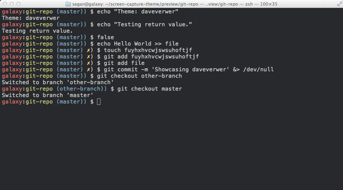
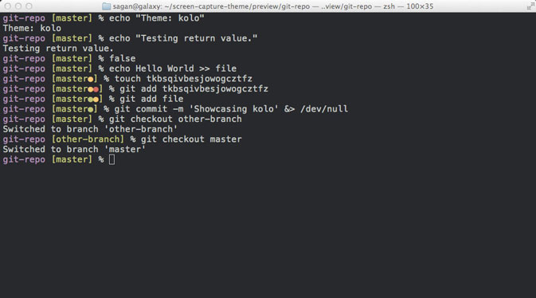
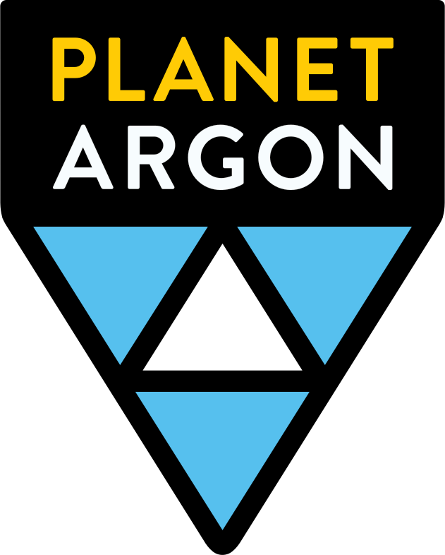

- [docs](https://github.com/ohmyzsh/ohmyzsh/wiki)
- [code](https://github.com/ohmyzsh/ohmyzsh/)
- [themes](https://github.com/ohmyzsh/ohmyzsh/wiki/Themes)
- [store](https://shop.planetargon.com/collections/oh-my-zsh)
- [community](https://ohmyz.sh/community.html)

[Fork me on Github](https://github.com/ohmyzsh/ohmyzsh)

## Unleash your terminal like never before.

Oh My Zsh is a delightful, open source, community-driven framework for managing your Zsh configuration. It comes bundled with thousands of helpful functions, helpers, plugins, themes, and a few things that make you shout...

# "Oh My ZSH!"

[Install oh-my-zsh](#install)

- 
- 
- 
- 
- 
- 

## What is Oh My Zsh?

Oh My Zsh is an open source, community-driven framework for managing your Zsh configuration.

Sounds boring. Let's try again.

Oh My Zsh will not make you a 10x developer...but you may feel like one!

Once installed, your terminal shell will become the talk of the town or your money back! With each keystroke in your command prompt, you'll take advantage of the hundreds of powerful plugins and beautiful themes. Strangers will come up to you in cafés and ask you, *"that is amazing! are you some sort of genius?"*

Finally, you'll begin to get the sort of attention that you have always felt you deserved. ...or maybe you'll use the time that you're saving to start flossing more often. 😬

### Plugins

Oh My Zsh comes bundled with plugins that'll make your life as a software developer easier and leave you feeling like a superhero.

[Browse 275+ plugins](https://github.com/ohmyzsh/ohmyzsh/wiki/Plugins)

### Community

Oh My Zsh has a vibrant community of happy users and delightful contributors. Without all the time and help from our contributors, it wouldn't be so awesome.

[Start contributing](https://github.com/ohmyzsh/ohmyzsh/wiki/Volunteers)

### Themes

We'll admit it. Early in the Oh My Zsh world, we may have gotten a bit too theme happy. We currently ship with 150 themes bundled.

[Find your new theme](https://github.com/ohmyzsh/ohmyzsh/wiki/Themes)

### "As others have said and I’ll say as well, install @ohmyzsh. It takes the magic of zsh, bottles it up, and then anytime you use the CLI out comes a genie and asks you your wish.
Without it, discovering the greatness of zsh requires a PhD."

[benj_fry](https://twitter.com/benj_fry/status/1225782423612346369?s=20)

### Install oh-my-zsh now

Oh My Zsh is installed by running one of the following commands in your terminal. You can install this via the command-line with either curl or wget.

- Install oh-my-zsh via curl
- Install oh-my-zsh via wget

$ sh -c "$(curl -fsSL https://raw.github.com/ohmyzsh/ohmyzsh/master/tools/install.sh)"

Not ready to jump right in? We’re not offended; it’s never a bad idea to [read the documentation](https://github.com/ohmyzsh/ohmyzsh/wiki) first.

Psst… Oh My Zsh works best on macOS or Linux.

### Got Plugins?

If you don’t, we do! Oh My Zsh includes over 275 plugins, and we like to share. Here are some featured plugins:

[See all plugins](https://github.com/ohmyzsh/ohmyzsh/tree/master/plugins)

### Oh My Swag!

We have t-shirts, stickers, and coffee mugs available to show off your 💖 of Oh My ZSH

### Need a little more?

Go ahead. Follow us. We're on the social media.

#### Oh My Zsh

Your favorite shell framework

[@ohmyzsh](https://twitter.com/ohmyzsh)

#### Robby Russell

Creator of Oh My Zsh

[@robbyrussell](https://twitter.com/robbyrussell)

#### Marc Cornellà

Maintainer of Oh My Zsh

[@MarcCornella](https://twitter.com/MarcCornella)

Join the conversation on the [ohmyzsh](https://discord.gg/bpXWhnN) server on Discord

#### Planet Argon

Oh My Zsh was started by the team at [Planet Argon](https://www.planetargon.com/). We help companies with existing Ruby on Rails applications make them better and more maintainable.

Check out our other [open source projects](https://www.planetargon.com/open-source).

[@planetargon](https://twitter.com/planetargon)

- [Documentation](https://github.com/ohmyzsh/ohmyzsh/wiki)
- [Code](https://github.com/ohmyzsh/ohmyzsh/)
- [Themes](https://github.com/ohmyzsh/ohmyzsh/wiki/Themes)
- [Store](https://shop.planetargon.com/collections/oh-my-zsh)
- [Community](https://ohmyz.sh/community.html)
- [Contribute](https://github.com/ohmyzsh/ohmyzsh/blob/master/CONTRIBUTING.md)

 

©2009 - 2020 [Robby Russell](https://www.planetargon.com/about/robby-russell) & [Contributors](https://github.com/ohmyzsh/ohmyzsh/graphs/contributors)

[Code of Conduct](https://github.com/ohmyzsh/ohmyzsh/blob/master/CODE_OF_CONDUCT.md)

An open source [Planet Argon](https://www.planetargon.com "Ruby on Rails Development Firm") project under the terms of the [MIT License](https://github.com/ohmyzsh/ohmyzsh/blob/master/LICENSE.txt)