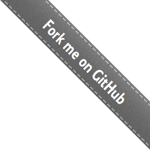

# [Homebrew](https://brew.sh/)

**The Missing Package Manager for macOS (or Linux)**

- ## Install Homebrew
    
    ```
    /bin/bash -c "$(curl -fsSL https://raw.githubusercontent.com/Homebrew/install/HEAD/install.sh)"
    ```
    
    Paste that in a macOS Terminal or Linux shell prompt.
    
    The script explains what it will do and then pauses before it does it. Read about other [installation options](https://docs.brew.sh/Installation).
    
- ## What Does Homebrew Do?
    
    Homebrew installs [the stuff you need](https://formulae.brew.sh/formula/ "List of Homebrew packages") that Apple (or your Linux system) didn’t.
    
    ```
    $ brew install wget
    ```
    
- Homebrew installs packages to their own directory and then symlinks their files into `/usr/local`.
    
    ```
    $ cd /usr/local
    $ find Cellar
    Cellar/wget/1.16.1
    Cellar/wget/1.16.1/bin/wget
    Cellar/wget/1.16.1/share/man/man1/wget.1
    
    $ ls -l bin
    bin/wget -> ../Cellar/wget/1.16.1/bin/wget
    ```
    
- Homebrew won’t install files outside its prefix and you can place a Homebrew installation wherever you like.
    
- Trivially create your own Homebrew packages.
    
    ```
    $ brew create https://foo.com/bar-1.0.tgz
    Created /usr/local/Homebrew/Library/Taps/homebrew/homebrew-core/Formula/bar.rb
    ```
    
- It’s all Git and Ruby underneath, so hack away with the knowledge that you can easily revert your modifications and merge upstream updates.
    
    ```
    $ brew edit wget # opens in $EDITOR!
    ```
    
- Homebrew formulae are simple Ruby scripts:
    
    ```
    class Wget < Formula
      homepage "https://www.gnu.org/software/wget/"
      url "https://ftp.gnu.org/gnu/wget/wget-1.15.tar.gz"
      sha256 "52126be8cf1bddd7536886e74c053ad7d0ed2aa89b4b630f76785bac21695fcd"
    
      def install
        system "./configure", "--prefix=#{prefix}"
        system "make", "install"
      end
    end
    ```
    
- Homebrew complements macOS (or your Linux system). Install your RubyGems with `gem` and their dependencies with `brew`.
    
- “To install, drag this icon…” no more. [Homebrew Cask](https://formulae.brew.sh/cask/) installs macOS apps, fonts and plugins and other non-open source software.
    
    ```
    $ brew install --cask firefox
    ```
    
- Making a cask is as simple as creating a formula.
    
    ```
    $ brew create --cask foo
    Editing /usr/local/Homebrew/Library/Taps/homebrew/homebrew-cask/Casks/foo.rb
    ```
    
- ## Further Documentation
    
    [docs.brew.sh](https://docs.brew.sh)
    
- ## Donate to Homebrew
    
    [Homebrew/brew#donations](https://github.com/homebrew/brew#donations)
    
- ## Community Discussion
    
    [Homebrew/discussions](https://github.com/Homebrew/discussions/discussions)
    
- ## Homebrew Blog
    
    [brew.sh/blog](https://brew.sh/blog/)
    
- ## Homebrew Packages
    
    [formulae.brew.sh](https://formulae.brew.sh/)
    
- ## Analytics Data
    
    [formulae.brew.sh/analytics](https://formulae.brew.sh/analytics/)
    
- Homebrew was created by [Max Howell](https://mxcl.github.io/). Website by [Rémi Prévost](https://exomel.com/), [Mike McQuaid](https://mikemcquaid.com) and [Danielle Lalonde](https://cargocollective.com/danilalo).
    

[](https://github.com/Homebrew/brew)