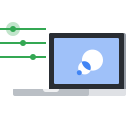

- [# Machine Learning Crash Course](https://developers.google.com/machine-learning)

[Courses](https://developers.google.com/machine-learning/crash-course) [Practica](https://developers.google.com/machine-learning/practica) [Guides](https://developers.google.com/machine-learning/guides) Glossary

[Crash Course](https://developers.google.com/machine-learning/crash-course) [Problem Framing](https://developers.google.com/machine-learning/problem-framing) [Data Prep](https://developers.google.com/machine-learning/data-prep) [Clustering](https://developers.google.com/machine-learning/clustering) [Recommendation](https://developers.google.com/machine-learning/recommendation) [Testing and Debugging](https://developers.google.com/machine-learning/testing-debugging) [GANs](https://developers.google.com/machine-learning/gan)

Google is committed to advancing racial equity for Black communities. [See how.](https://google.com/racialequity)

### [### Machine Learning Crash Course #### with TensorFlow APIs](https://developers.google.com/machine-learning/crash-course/ml-intro)

Google's fast-paced, practical introduction to machine learning

[Start Crash Course](https://developers.google.com/machine-learning/crash-course/ml-intro) [View prerequisites](https://developers.google.com/machine-learning/crash-course/prereqs-and-prework)

### A self-study guide for aspiring machine learning practitioners

Machine Learning Crash Course features a series of lessons with video lectures, real-world case studies, and hands-on practice exercises.

- 
    
    30+ exercises
    
- 
    
    25 lessons
    
- 
    
    15 hours
    
- 
    
    Lectures from Google researchers
    
- 
    
    Real-world case studies
    
- 
    
    Interactive visualizations of algorithms in action
    

### Some of the questions answered in this course

Learn best practices from Google experts on key machine learning concepts.

- How does machine learning differ from traditional programming?
    
- What is loss, and how do I measure it?
    
- How does gradient descent work?
    
- How do I determine whether my model is effective?
    
- How do I represent my data so that a program can learn from it?
    
- How do I build a deep neural network?
    

### [Ready to start practicing machine learning?](https://developers.google.com/machine-learning/crash-course/ml-intro)

Learn and apply fundamental machine learning concepts with the Crash Course, get real-world experience with the companion Kaggle competition, or visit Learn with Google AI to explore the full library of training resources.

[Start Crash Course](https://developers.google.com/machine-learning/crash-course/ml-intro) [Learn with Google AI](https://ai.google/education)

- ### Connect
    
    - [Blog](https://googledevelopers.blogspot.com)
    - [Facebook](https://www.facebook.com/Google-Developers-967415219957038)
    - [Medium](https://medium.com/google-developers)
    - [Twitter](https://twitter.com/googledevs)
    - [YouTube](https://www.youtube.com/user/GoogleDevelopers)
- ### Programs
    
    - [Women Techmakers](https://www.womentechmakers.com)
    - [Google Developer Groups](https://developers.google.com/community/gdg)
    - [Google Developers Experts](https://developers.google.com/community/experts)
    - [Accelerators](https://developers.google.com/community/accelerators)
    - [Developer Student Clubs](https://developers.google.com/community/dsc)
- ### Developer consoles
    
    - [Google API Console](https://console.developers.google.com)
    - [Google Cloud Platform Console](https://console.cloud.google.com)
    - [Google Play Console](https://play.google.com/apps/publish)
    - [Firebase Console](https://console.firebase.google.com)
    - [Actions on Google Console](https://console.actions.google.com)
    - [Cast SDK Developer Console](https://cast.google.com/publish)
    - [Chrome Web Store Dashboard](https://chrome.google.com/webstore/developer/dashboard)

- [Android](https://developer.android.com)
- [Chrome](https://developer.chrome.com/home)
- [Firebase](https://firebase.google.com)
- [Google Cloud Platform](https://cloud.google.com)
- [All products](https://developers.google.com/products)

- [Terms](https://developers.google.com/terms/site-terms)
- [Privacy](https://policies.google.com/privacy)
- Sign up for the Google Developers newsletter [Subscribe](https://services.google.com/fb/forms/googledevelopersnewsletter/?utm_medium=referral&utm_source=google-products&utm_team=googledevs&utm_campaign=201611-newsletter-launch)