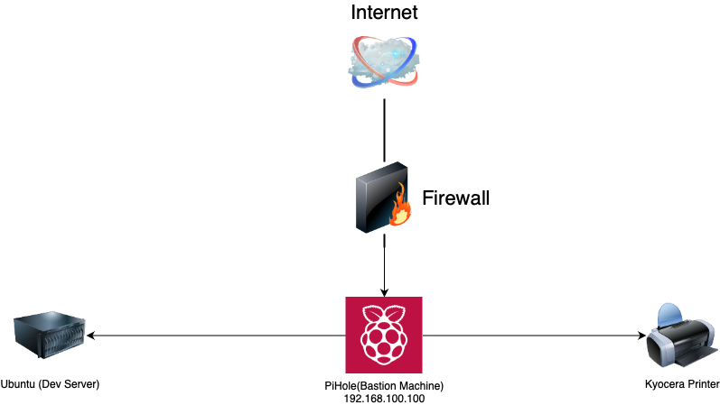

* IP Range: 192.168.100.0/24
* Devices:
	* Raspberry Pi 4/8gb Unbuntu Server:
		* IP Address: 192.168.100.120
		* User: ubuntu
	* Raspberry Pi Zero Pihole:
		* IP Address: 192.168.100.100
		* User: pi
	* Raspberry Pi Zero Mydev:
		* IP Address: 192.168.100.125
		* User: pi
	* Raspberry Pi Zero Mydev2:
		* IP Address: 192.168.100.90
		* User: pi 
* External network access
	* IP: 105.209.35.12
	* DDNS: sahomeserver.duckdns.org
	* Ports
		* External: 2022
		* Internal: 192.168.100.120:22 (Rasbperry Pi 8gb Server)
* Connecting via ssh: `ssh -p 2022 ubuntu@sahomeserver.duckdns.org`
* Need to configure home assistant
## Network Overview

