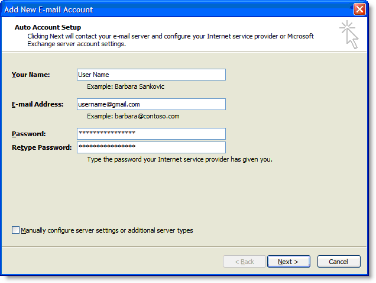
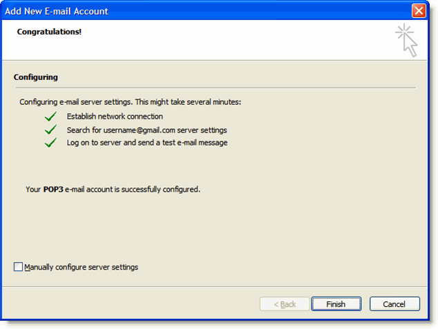
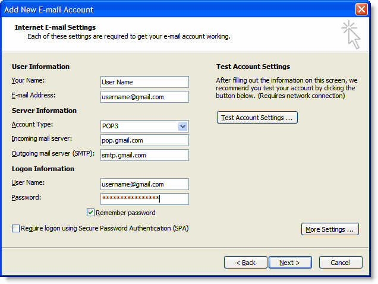
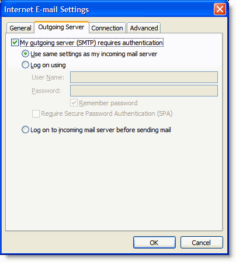
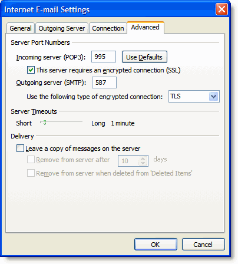

[**Proud USA Company**](https://www.webdesignerexpress.com/blog/web-design-usa.html)

[**Hablamos Español**](https://www.webdesignerexpress.com/blog/landing/pagina-web-miami.html)

[**Falamos Português**](https://www.webdesignerexpress.com/blog/landing/criacao-de-website-299.html)

[**305.386.9003**](tel:305.386.9003)

- [Our Work](https://www.webdesignerexpress.com/blog/portfolio)
- [Services](https://www.webdesignerexpress.com/blog/services.html)
- [Prices](https://www.webdesignerexpress.com/blog/prices.html)
- [Blog](https://www.webdesignerexpress.com/blog/blog)
- [FAQ](https://www.webdesignerexpress.com/blog/faqs.html)
- [Contact](https://www.webdesignerexpress.com/blog/contact.html)

# Web Design **Latest Trends** & **Help Articles**

[General](https://www.webdesignerexpress.com/blog/blog "General")

[Web Design](https://www.webdesignerexpress.com/blog/blog/web-design "Web Design")

[E-commerce](https://www.webdesignerexpress.com/blog/blog/ecommerce "E-commerce")

[Mobile](https://www.webdesignerexpress.com/blog/blog/mobile "Mobile")

[Internet Marketing](https://www.webdesignerexpress.com/blog/blog/internet-marketing "Internet Marketing")

[Technology](https://www.webdesignerexpress.com/blog/blog/technology "Technology")

2.  [Blog](https://www.webdesignerexpress.com/blog)
3.  [Technology](https://www.webdesignerexpress.com/blog/technology)
4.  [How to setup gmail with outlook 2007 - gmail configuration for outlook](https://www.webdesignerexpress.com/blog/how-to-setup-gmail-with-outlook-2007-gmail-configuration-for-outlook.html)

## How to setup gmail with outlook 2007 - gmail configuration for outlook

by [JL Garcia](https://www.webdesignerexpress.com/blog/blog/author/JL+Garcia) on Mar 10, 2009 Category: [Technology](https://www.webdesignerexpress.com/blog/blog/technology) (422117 Views)

* * *

### To configure Outlook 2007 for your Gmail address:

1.  [Enable POP in your email account](https://mail.google.com/support/bin/answer.py?answer=13273). Don't forget to click **Save Changes** when you're done.
2.  Open Outlook.
3.  Click the **Tools** menu, and select **Account Settings...**
4.  On the **E-mail** tab, click **New...**
5.  If you are prompted to **Choose E-mail Service**, select **Microsoft Exchange**, **POP3**, **IMAP**, or **HTTP**, and click **Next**.
6.  Fill in all necessary fields to include the following information:

**Your Name:** Enter your name as you would like it to appear in the From: field of outgoing messages.
**Email Address:** Enter your full Gmail email address (*username@gmail.com*). Google Apps users, enter your full address in the format *username@your_domain.com*.
**Password:** Enter your email password.

**Manually configure server settings or additional server types:** Leave this option unchecked if you want to automatically configure Outlook 2007. If you want to manually configure Outlook 2007, check this box now. Google Apps users should configure manually as follows.

1.  Click **Next**. If you are configuring Outlook 2007 automatically, you're done! Just click **Finish**.

1.  If you are configuring Outlook 2007 manually, select **Internet E-mail** and click **Next**.
2.  Verify your **User Information**, and enter the following additional information:

**Server Information**

**Account Type:** POP3

**Incoming mail server:** [pop.gmail.com](http://pop.gmail.com) (Google Apps users, enter the server names provided, don't add your domain name in these steps)

**Outgoing mail server (SMTP):** [smtp.gmail.com](http://smtp.gmail.com)

**Logon Information**

**User Name:** Enter your Gmail username (including @*[gmail.com](http://gmail.com)*). Google Apps users, enter your full address in the format *username@your_domain.com*

**Password:** Enter your email password.

**Require logon using Secure Password Authentication (SPA):** Leave this option unchecked.

1.  Click the **More Settings...** button, and select the **Outgoing Server** tab.
2.  Check the box next to **My outgoing server (SMTP) requires authentication** and select **Use same settings as my incoming mail server.**

1.  Click the **Advanced tab**, and check the box next to **This server requires an encrypted connection (SSL)** under **Incoming Server (POP3)**.
2.  In the **Outgoing server (SMTP)** box, enter 587, and select **TLS** from the drop-down menu next to **Use the following type of encrypted connection:**.

1.  Click **OK**.
2.  Click **Test Account Settings...** After receiving 'Congratulations! All tests completed successfully', click **Close.**
3.  Click **Next**, and then click **Finish.**

**Congratulations!** You're done configuring your client to send and retrieve Gmail messages.

* * *

Tags: [how to setup gmail with outlook 2007](https://www.webdesignerexpress.com/blog/blog/tag/how-to-setup-gmail-with-outlook-2007) [gmail](https://www.webdesignerexpress.com/blog/blog/tag/-gmail)

### Related Articles

1.  [What to know before launching my website.](https://www.webdesignerexpress.com/blog/blog/what-to-know-before-launching-my-website.html "What to know before launching my website.")
2.  [Why and How my Website Got Hacked?](https://www.webdesignerexpress.com/blog/blog/why-and-how-my-website-got-hacked.html "Why and How my Website Got Hacked?")
3.  [Web design for startups - Learn why you need a website](https://www.webdesignerexpress.com/blog/blog/web-design-for-startups-learn-why-you-need-a-webs.html "Web design for startups - Learn why you need a website")
4.  [CSS glyphs and other special characters for HTML, javascript and CSS](https://www.webdesignerexpress.com/blog/blog/css-glyphs-and-html-special-characters.html "CSS glyphs and other special characters for HTML, javascript and CSS")
5.  [Custom Web Development To Make the Difference for a Country](https://www.webdesignerexpress.com/blog/blog/custom-web-development-to-make-the-difference-html.html "Custom Web Development To Make the Difference for a Country")

* * *

\* Let us keep you updated with the latest new tips, tech news and helpful articles!

Subscribe Now

#### Subscribe to our mailing list

\* Your privacy is very important to us.  You email will never be share with any 3rd private party.  We guarantee that all email from us will be valuable information we believe will be helpful to you or your business. We never send spam.

## What our (Partners/Customers) **are saying**

This is my second time hiring Web Designer Express. I want to thank Gus and JP for doing a great job creating my website. I personally endorse them to anymore seeking assistance with creating a website. I defiantly will use them again with my next project :) Again gentlemen, thanks for all your help making my website come to life!

**Michael Rose, Primetime Car Wash**
**Miami, Florida - USA**

Helpful Navigation Links

[Home](https://www.webdesignerexpress.com/) . [Company](https://www.webdesignerexpress.com/blog/company.html) . [Our Work](https://www.webdesignerexpress.com/blog/portfolio) . [Services](https://www.webdesignerexpress.com/blog/services.html) . [Prices](https://www.webdesignerexpress.com/blog/prices.html) . [Blog](https://www.webdesignerexpress.com/blog/blog) . [Reviews](https://www.webdesignerexpress.com/blog/reviews) . [Graphics Design](https://www.webdesignerexpress.com/blog/services/miami-graphics-design.html) . [Contact](https://www.webdesignerexpress.com/blog/contact.html) . [Sitemap](https://www.webdesignerexpress.com/blog/sitemap)

#### **Proudly located in the Miami, FL**

##### **Web Designer Express**

5600 SW 135 Ave, Suite 105
Miami, FL 33183

Rated **5.0** stars on Google+
based on **74** reviews

[**Get Directions**](https://www.google.com/maps/place/Web+Designer+Express/@25.7141883,-80.4154075,17z/data=!3m1!4b1!4m2!3m1!1s0x88d9c07d214b9023:0x5f1f92752bb309fb)

Contact **Sales**
**Phone: [305.386.9003](tel:3053869003)**

Contact **Support**
**Phone: [305.386.9003](tel:3053869003)**
**After Hours: [(954)226.7412](tel:9542267412)**

Toll **Free**
**Phone: [1.866.405.2040](tel:18664052040)**

Become a part of our family
Speak to a Specialist

#### [**305.386.9003**](tel:305.386.9003)

© 2021 Miami Web Design Company / Web Designer Express, All rights reserved. [Privacy](https://www.webdesignerexpress.com/blog/privacy.html) | [Terms and Conditions](https://www.webdesignerexpress.com/blog/terms.html)